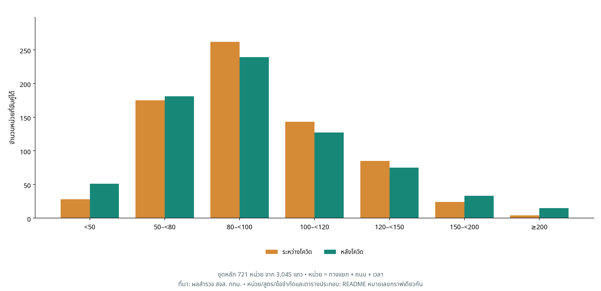
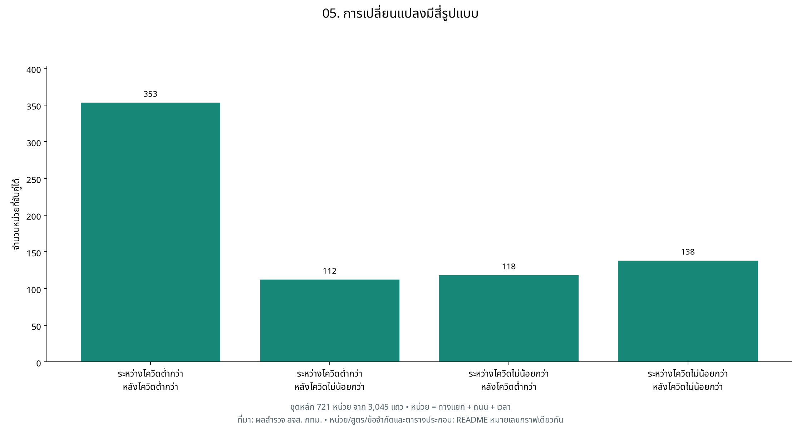
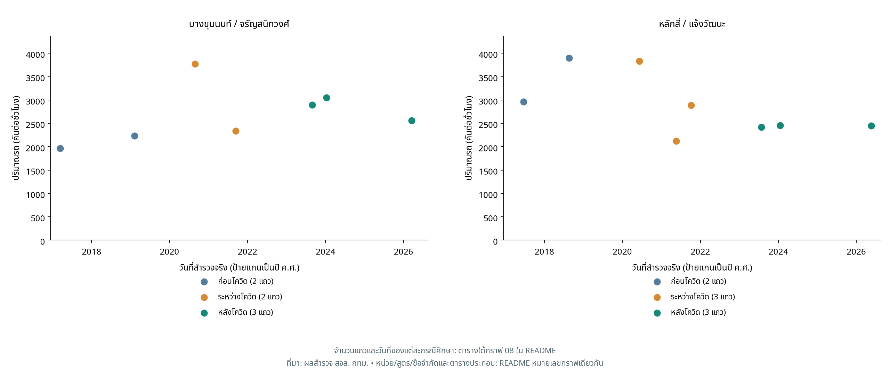
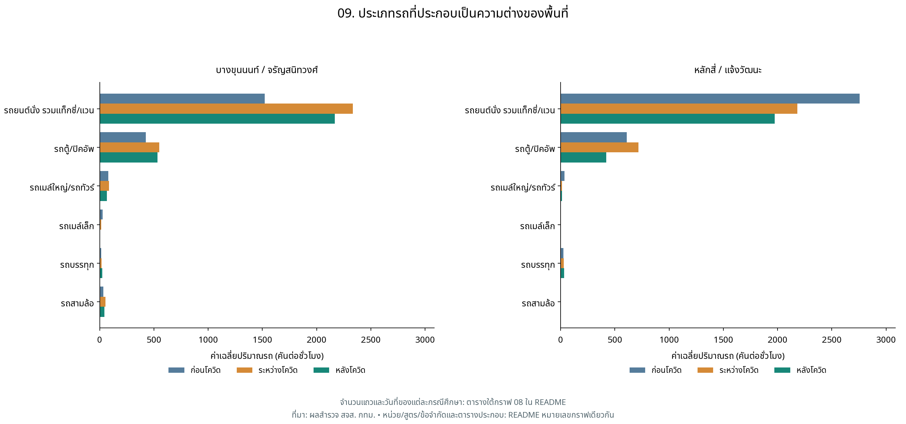
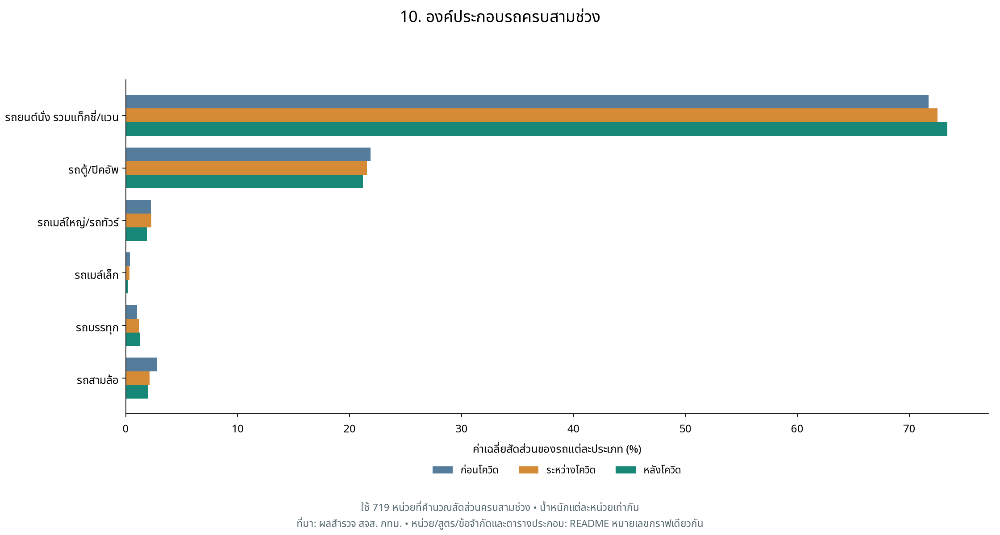
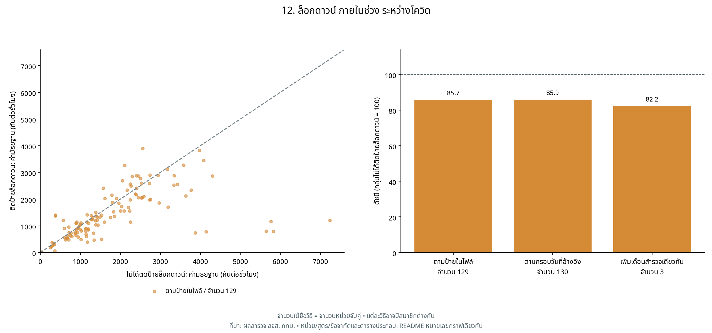
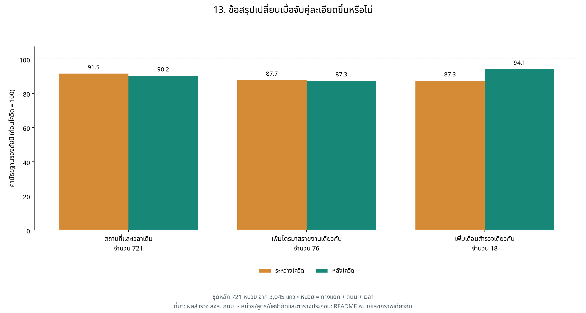

# DADS5001 — BKK Flow

## การศึกษาปริมาณการจราจรบริเวณทางแยกในกรุงเทพมหานคร ก่อน ระหว่าง และหลังโควิด-19
**ผู้จัดทำ:** 
1. ธนัชชา ละครพล     6820422006
2. พรภัสสร พัฒนไพบูลย์ 6820422010
3. อภัสรา แข็งเขตต์     6820422016
  
**GitHub:** [https://github.com/Aphatsara-Khangkhet/DADS5001-BKK-Flow](https://github.com/Aphatsara-Khangkhet/DADS5001-BKK-Flow)  

ข้อมูลที่ใช้: `bangkok_traffic_2560_Present (NotFinal).xlsx` ชีต `traffic_data` วันที่สำรวจ 2017-03-01 ถึง 2026-05-29 (วัน–เดือน–ปีที่แสดงในตารางใช้ ค.ศ.) 

## ที่มาและขอบเขต

โครงงานนี้เริ่มจากความสนใจว่าปริมาณการจราจรบริเวณทางแยกในกรุงเทพมหานครแตกต่างกันอย่างไรในช่วงก่อน ระหว่าง และหลังการระบาดของโควิด-19 โดยต้องการสำรวจว่าปริมาณรถในช่วงระหว่างโควิดเปลี่ยนแปลงจากระดับก่อนโควิดอย่างไร และในช่วงหลังโควิดกลับมาใกล้เคียงระดับเดิมหรือไม่ รวมทั้งการเปลี่ยนแปลงดังกล่าวมีรูปแบบเหมือนหรือต่างกันในแต่ละสถานที่ จึงนำข้อมูลจำนวนรถที่ผ่านจุดสำรวจจากรายงานปริมาณจราจรบริเวณทางแยกของสำนักการจราจรและขนส่ง กรุงเทพมหานคร มาวิเคราะห์เปรียบเทียบสถานที่ ถนน และช่วงเวลาเดียวกันระหว่างสามช่วง เพื่ออธิบายรูปแบบการเปลี่ยนแปลงของปริมาณรถในชุดข้อมูล ทั้งนี้ การศึกษามุ่งสำรวจความแตกต่างระหว่างช่วงเวลา โดยยังไม่สามารถสรุปได้ว่าโควิด-19 เป็นสาเหตุของความแตกต่างทั้งหมด
สำนักการจราจรและขนส่ง กรุงเทพมหานครเผยแพร่ [รายงานปริมาณจราจรบริเวณทางแยก](https://traffic.bangkok.go.th/re_intersection/intersection/intersection.html) แยกตามเดือน งานนี้นำไฟล์ที่รวบรวมจากรายงานมาทำการวิเคราะห์ข้อมูลเชิงสำรวจด้วยเพื่อเปรียบเทียบปริมาณรถของหน่วยเดิมและสำรวจความต่างรายสถานที่/ประเภทรถ ใช้ `covid_period` ตามไฟล์เป็นเกณฑ์จัดกลุ่ม
| ช่วง | ชื่อในไฟล์ | ขอบเขตการเล่าในรายงาน |
| --- | --- | --- |
| ก่อนโควิด | ก่อนโควิด | ปี 2017–2019; ไม่รวม 2016 |
| ระหว่างโควิด | โควิด | ปี 2020–2021 |
| หลังโควิด | หลังโควิด | ปี 2022 จนถึงวันล่าสุดในไฟล์ ไม่ใช่ข้อมูลครบปีล่าสุด |

ข้อมูลเป็น **จำนวนรถที่ผ่านจุดสำรวจในช่วงเวลาที่ระบุ** มีหกหมวด ได้แก่ รถยนต์นั่ง รถตู้/ปิคอัพ รถเมล์ใหญ่ รถเมล์เล็ก รถบรรทุก และรถสามล้อ ตามฟิลด์ที่รวบรวมมา ไม่มีข้อมูลความเร็ว ระยะเวลาเดินทาง จำนวนผู้โดยสาร จักรยานยนต์ หรือจุดหมายการเดินทาง จึงตอบเรื่องปริมาณรถในชุดสำรวจ ไม่ใช่ระดับรถติดหรือพฤติกรรมคนทั้งกรุงเทพฯ นิยามหมวดย่อยและบริบทงานสำรวจอ่านประกอบได้จาก [คู่มือ สจส. หน้าเอกสาร 133–137](https://traffic.bangkok.go.th/TechnicalManuals/TTD.pdf#page=139) แต่คู่มือไม่ได้ยืนยันเหตุผลเลือกสำรวจทุกจุดในไฟล์นี้


## คำถาม–สมมติฐาน–หลักฐาน–ข้อสรุป

สมมติฐานด้านล่างเป็นแนวทางสำรวจ ไม่ใช่ผลทดสอบนัยสำคัญทางสถิติ

| คำถาม | สมมติฐานที่ตรวจ | หลักฐาน | ข้อสรุปที่ข้อมูลรองรับ |
| --- | --- | --- | --- |
| หน่วยเดิมเปลี่ยนในสามช่วงอย่างไร | ค่ากลางระหว่างและหลังต่ำกว่าก่อน | กราฟ 2: ก่อนโควิด 100 → ระหว่างโควิด 91.5 → หลังโควิด 90.2 | จำนวน 721 หน่วย | รองรับเชิงพรรณนาในชุดจับคู่ ไม่ใช่ทุกพื้นที่ |
| ทุกหน่วยกลับถึงฐานเหมือนกันหรือไม่ | หน่วยมีรูปแบบเพิ่ม/ลดต่างกัน | กราฟ 4–5: หลังโควิด มี 250/721 หน่วย (34.7%) ที่ไม่น้อยกว่าฐาน | ความต่างรายหน่วยสำคัญ ค่ากลางแทนทุกจุดไม่ได้ |
| สัดส่วนรถเหมือนเดิมหรือไม่ | หมวดรถยนต์นั่งมีสัดส่วนสูงขึ้น | กราฟ 10–11: รถยนต์รวมแท็กซี่: 71.72% → 72.51% → 73.39% | จำนวน 719 | สัดส่วนในหกหมวดเปลี่ยน ไม่ยืนยันการเปลี่ยนวิธีเดินทาง |
| กลุ่มล็อกดาวน์ต่างจากกลุ่มอื่นหรือไม่ | ปริมาณต่ำกว่าในหน่วยที่จับคู่ได้ | กราฟ 12: ดัชนี 85.7; ป้ายต่างจากกรอบวันที่ 168 แถว | ผลสำรวจเบื้องต้น ขึ้นกับนิยามและองค์ประกอบวัน |
| ผลไวต่อการจับคู่ปฏิทินหรือไม่ | การเพิ่มเงื่อนไขวันอาจเปลี่ยนขนาดผล | กราฟ 13: จำนวน 721: ระหว่างโควิด 91.5, หลังโควิด 90.2; จำนวน 76: ระหว่างโควิด 87.7, หลังโควิด 87.3; จำนวน 18: ระหว่างโควิด 87.3, หลังโควิด 94.1 | ขนาดผลและจำนวนตัวอย่างเปลี่ยน ต้องรายงานทั้งสองอย่าง |

## ข้อมูลพร้อมใช้แค่ไหน และคำนวณอย่างไร

| ขั้นตอน | จำนวน | ความหมาย |
| --- | ---: | --- |
| แถวดิบ | 17,440 | แถวจากชีต traffic_data |
| ผ่านเกณฑ์เบื้องต้น | 17,250 | หลังคัดปัญหาที่ระบุใน audit |
| แถวในชุดจับคู่หลัก | 3,045 | แถวของหน่วยที่มีครบสามช่วง |
| หน่วยจับคู่หลัก | 721 | ทางแยก + ถนน + ช่วงเวลา ไม่ใช่จำนวนแยก |
| ทางแยกในชุดจับคู่ | 204 | แยกเดียวอาจมีหลายถนน/เวลา |

ดู [Data Feasibility และ Matching Audit](docs/audit.md) และ [แถวในชุดจับคู่](tables/matched_observations.csv) เพื่อย้อนกลับไปวันที่และเลขแถว Excel ค่าว่าง/ขีดในหมวดรถแทนศูนย์ตามข้อตกลง แต่วันหรือสถานที่ที่ไม่มีการสำรวจจะไม่ถูกสร้างเป็นศูนย์ แถวซ้ำที่มีปัญหาและค่าจำนวนรถที่ไม่เหมาะสมถูกแยกก่อนคำนวณ ไม่ควรนำจำนวนกลุ่มปัญหาที่ซ้อนกันมาบวกเป็นแถวตัดออกซ้ำ

สูตรหลัก: **คันต่อชั่วโมง = ผลรวมรถหกหมวด ÷ ชั่วโมงสำรวจ** → หาค่ามัธยฐานรายหน่วยในแต่ละช่วง → **ดัชนี = ค่าระหว่างหรือหลัง ÷ ค่าก่อนของหน่วยเดียวกัน × 100** → สรุปค่ามัธยฐานดัชนีข้ามหน่วยที่จับคู่ครบและฐานเป็นบวก ค่ามัธยฐานคือค่ากลางเมื่อเรียงข้อมูล ไม่ใช่ผลรวมหารจำนวนซึ่งเรียกว่าค่าเฉลี่ย


## กราฟและคำอธิบายตามลำดับ


### กราฟ 01 — ข้อมูลครอบคลุมวันใดบ้าง


กราฟแสดงจำนวนรายการสำรวจการจราจรที่ผ่านเกณฑ์ตรวจสอบเบื้องต้น แยกตามปีและเดือนรายงาน โดยสีเข้มหมายถึงมีรายการสำรวจมาก และสีอ่อนหมายถึงมีรายการสำรวจน้อย ตัวเลขในแต่ละช่องเป็นจำนวนแถวข้อมูล ไม่ใช่จำนวนรถ เนื่องจากการสำรวจหนึ่งวันอาจมีหลายทางแยก หลายถนน และหลายช่วงเวลา

จุดที่เห็นชัดคือเดือนเมษายน 2020 มีข้อมูลเพียง 9 แถว ซึ่งอยู่ในเดือนที่คาบเกี่ยวกับมาตรการปิดสถานที่ในกรุงเทพมหานครช่วง 22 มีนาคม–12 เมษายน 2020 ตามรายงานของไทยโพสต์ มาตรการดังกล่าวเป็นบริบทสำคัญที่ควรนำมาพิจารณาในการศึกษาการเดินทาง อย่างไรก็ตาม ข่าวนี้ยังไม่ยืนยันสาเหตุที่จำนวนรายการสำรวจในไฟล์มีน้อย และกราฟนี้เพียงอย่างเดียวไม่สามารถบอกได้ว่าปริมาณรถลดลงเท่าไร [ไทยโพสต์](https://www.thaipost.net/main/detail/60470)

นอกจากนี้ ปี 2017 ไม่มีรายการในเดือนมกราคมและกุมภาพันธ์ ส่วนปี 2026 มีรายการเฉพาะเดือนมกราคมถึงพฤษภาคม ค่า 0 จึงหมายถึงไม่มีรายการในชุดข้อมูลที่นำมาวิเคราะห์ ไม่ใช่จำนวนรถเป็นศูนย์ ความครอบคลุมที่ต่างกันทำให้ไม่ควรนำยอดรถรวมรายปีมาเปรียบเทียบโดยตรง งานนี้จึงเลือกเปรียบเทียบทางแยก ถนน และช่วงเวลาเดียวกัน พร้อมปรับจำนวนรถเป็นคันต่อชั่วโมง ก่อนพิจารณาการเปลี่ยนแปลงระหว่างช่วงก่อน ระหว่าง และหลังโควิด


### กราฟ 02 - แนวโน้มปริมาณรถทุกประเภทรวมกันเฉลี่ยรายปี (2560 - ปัจจุบัน)
https://colab.research.google.com/gist/thanutcha6639-beep/4db2f845c4020b8eaa29ebbef5183607/untitled10.ipynb#scrollTo=fr9qNQzxaD2A&fullscreenOutput=true


กราฟแสดงค่าเฉลี่ยของปริมาณรถรวมในแต่ละปี โดยพื้นที่เงารอบเส้นแสดงค่าคลาดเคลื่อนมาตรฐานของค่าเฉลี่ย (±1 SEM) ผลการวิเคราะห์พบว่าปริมาณรถเฉลี่ยมีความผันผวนตลอดช่วงเวลาที่ศึกษา โดยอยู่ในระดับค่อนข้างสูงในปี 2017 และ 2019 ก่อนปรับลดลงต่อเนื่องในช่วงปี 2020-2022 จากนั้นเพิ่มขึ้นในปี 2023 ลดลงต่ำสุดในปี 2024 และปรับเพิ่มขึ้นอีกครั้งในปี 2025 ก่อนเปลี่ยนแปลงเพียงเล็กน้อยในปี 2026 เมื่อพิจารณาภาพรวม ปริมาณรถเฉลี่ยหลังปี 2020 ยังอยู่ต่ำกว่าระดับที่พบในช่วงปี 2017-2019 อย่างไรก็ตาม การเปรียบเทียบรายปีควรพิจารณาจำนวนรายการข้อมูล สถานที่ และช่วงเวลาที่สำรวจร่วมด้วย เนื่องจากความแตกต่างของความครอบคลุมข้อมูลอาจมีผลต่อค่าเฉลี่ยที่ปรากฏในกราฟ

### กราฟที่ 5 ดัชนีปริมาณรถตามเงื่อนไขการจับคู่ข้อมูล (ตัวอย่าง)


กราฟนำเสนอแนวคิดการเปรียบเทียบดัชนีปริมาณรถภายใต้เงื่อนไขการจับคู่ข้อมูล โดยกำหนดให้ค่าก่อนโควิด-19 เท่ากับ 100 ดัชนีที่ต่ำกว่า 100 จึงหมายถึงปริมาณรถในช่วงเปรียบเทียบต่ำกว่าค่าฐาน ตัวอย่างเช่น ดัชนี 91.6 แสดงว่าค่ากึ่งกลางต่ำกว่าฐานร้อยละ 8.4 การเพิ่มเงื่อนไขการจับคู่สถานที่ เวลา และไตรมาสช่วยแสดงว่าผลลัพธ์อาจเปลี่ยนแปลงตามวิธีคัดเลือกข้อมูล อย่างไรก็ตาม ค่าดัชนีและจำนวนตัวอย่างที่แสดงในกราฟนี้เป็นค่าที่กำหนดไว้เพื่อสาธิตวิธีวิเคราะห์ มิได้คำนวณจากข้อมูลต้นฉบับในขั้นตอนดังกล่าว จึงควรสร้างกราฟใหม่จากข้อมูลจริงก่อนนำตัวเลขไปใช้เป็นผลการศึกษา
หมายเหตุ: กราฟนี้แสดงตัวอย่างแนวทางการวิเคราะห์ ตัวเลขยังไม่ใช่ผลการศึกษาขั้นสุดท้าย

### กราฟ 03 ทางแยกที่มีปริมาณรถเฉลี่ยสูงสุดและต่ำสุด


กราฟเปรียบเทียบทางแยก 5 แห่งที่มีปริมาณรถรวมเฉลี่ยสูงสุดและ 5 แห่งที่มีค่าเฉลี่ยต่ำสุด โดยกลุ่มที่มีค่าเฉลี่ยสูงสุดอยู่ระหว่างประมาณ 32,947-42,258 คัน และทางแยกบรมราชชนนี-ราชพฤกษ์มีค่าสูงสุดประมาณ 42,258 คัน ขณะที่กลุ่มที่มีค่าเฉลี่ยต่ำสุดอยู่ระหว่างประมาณ 34-131 คัน ความแตกต่างระหว่างสองกลุ่มมีขนาดสูงมาก จึงอาจไม่ได้สะท้อนความหนาแน่นของการจราจรเพียงอย่างเดียว แต่อาจเกี่ยวข้องกับหน่วยข้อมูล ระยะเวลาสำรวจ จำนวนช่องทาง จำนวนครั้งที่สำรวจ หรือรายการข้อมูลที่ผิดปกติ ดังนั้น การจัดอันดับควรใช้ข้อมูลที่มีเงื่อนไขการสำรวจใกล้เคียงกันและตรวจสอบจำนวนรายการข้อมูลของแต่ละทางแยกประกอบ


### กราฟ 03 — แต่ละหน่วยอยู่เหนือหรือต่ำกว่าฐาน


กราฟแสดงการเปรียบเทียบปริมาณจราจรของแต่ละหน่วยทางแยก–ถนน–เวลา โดยใช้ค่าก่อนโควิดเป็นฐาน เส้นประแสดงระดับที่ปริมาณจราจรเท่ากับก่อนโควิด จุดที่อยู่ต่ำกว่าเส้นหมายถึงปริมาณจราจรลดลง ส่วนจุดเหนือเส้นหมายถึงเพิ่มขึ้น จาก 721 หน่วย พบว่าระหว่างโควิด 64.5% และหลังโควิด 65.3% มีปริมาณจราจรต่ำกว่าฐาน แสดงให้เห็นว่าแม้หน่วยส่วนใหญ่มีปริมาณลดลง แต่การเปลี่ยนแปลงไม่ได้เกิดขึ้นในทิศทางเดียวกันทุกพื้นที่


### กราฟที่ 3 สัดส่วนประเภทรถจำแนกตามช่วงโควิด-19 และสถานะการล็อกดาวน์


กราฟแสดงสัดส่วนของรถแต่ละประเภทในรูปแบบแท่งซ้อนร้อยละ 100 โดยกราฟด้านซ้ายเปรียบเทียบช่วงก่อน ระหว่าง และหลังโควิด-19 ส่วนกราฟด้านขวาเปรียบเทียบช่วงล็อกดาวน์กับช่วงที่ไม่มีการล็อกดาวน์ รถยนต์นั่งส่วนบุคคลมีสัดส่วนสูงสุดประมาณร้อยละ 70.2-71.9 รองลงมาคือรถกระบะและรถตู้ประมาณร้อยละ 23.0-24.6 ขณะที่รถประเภทอื่นมีสัดส่วนค่อนข้างน้อย ผลดังกล่าวแสดงว่าโครงสร้างของประเภทรถโดยรวมมีการเปลี่ยนแปลงไม่มากระหว่างกลุ่ม อย่างไรก็ตาม กราฟนี้แสดงสัดส่วน มิใช่จำนวนรถทั้งหมด จึงควรพิจารณาร่วมกับกราฟปริมาณรถเฉลี่ยเพื่อประเมินการเปลี่ยนแปลงของระดับการจราจร

### กราฟที่ 4 ปริมาณรถเฉลี่ยจำแนกตามช่วงโควิด-19 และสถานะการล็อกดาวน์


กราฟแสดงปริมาณรถเฉลี่ยจำแนกตามช่วงสถานการณ์โควิด-19 และสถานะการล็อกดาวน์ โดยปริมาณรถเฉลี่ยรวมลดลงจาก 7,927.1 คันในช่วงก่อนโควิด-19 เหลือ 6,961.0 คันในช่วงโควิด-19 คิดเป็นการลดลงประมาณร้อยละ 12.2 และลดลงเหลือ 6,641.8 คันในช่วงหลังโควิด-19 หรือต่ำกว่าช่วงก่อนโควิด-19 ประมาณร้อยละ 16.2 นอกจากนี้ ช่วงล็อกดาวน์มีปริมาณรถเฉลี่ย 6,806.5 คัน ซึ่งต่ำกว่าช่วงที่ไม่มีการล็อกดาวน์ที่มีค่าเฉลี่ย 7,088.9 คันประมาณร้อยละ 4.0 อย่างไรก็ตาม ความแตกต่างดังกล่าวอาจได้รับอิทธิพลจากจำนวนสถานที่ ช่วงเวลา ฤดูกาล และความครอบคลุมของข้อมูลที่ไม่เท่ากัน จึงยังไม่สามารถสรุปได้โดยตรงว่าการลดลงทั้งหมดเกิดจากมาตรการล็อกดาวน์

### Traffic Volumn Density Heatmaps by COVID Period & Lockdown Status


สรุปผลการวิเคราะห์ข้อมูลการจราจรจากกราฟ Heatmap ทั้งสองมุมมอง 1. เปรียบเทียบตามช่วงเวลา COVID (ภาพ A - โทนสีฟ้า)ปริมาณรถสูงสุด: กลุ่ม Passenger Car (รถยนต์นั่งส่วนบุคคล) มีปริมาณการใช้งานหนาแน่นที่สุดในทุกช่วงเวลา โดยช่วง Before COVID สูงที่สุดถึง 5,563.0 คัน   แนวโน้มการลดลง: ปริมาณการจราจรโดยรวมค่อย ๆ ลดลงจากช่วงก่อนโควิด ($5,563.0$ คัน) มาสู่ช่วงระหว่างโควิด ($4,947.5$ คัน) และหลังโควิด ($4,675.0$ คัน) ตามลำดับ ตามรูปแบบการเดินทางที่เปลี่ยนไป   ประเภทรถอื่นๆ: รถกลุ่ม Pickup/Van รองลงมาอยู่ที่ระดับประมาณ $1,600 - 1,900$ คัน ขณะที่รถบรรทุก, รถบัส และรถตุ๊กตุ๊ก มีปริมาณค่อนข้างน้อยและคงที่ในแต่ละช่วง   📌 2. เปรียบเทียบช่วง Lockdown กับ Not Lockdown (ภาพ B - โทนสีส้ม)ผลกระทบจากมาตรการ: ในช่วง Lockdown ปริมาณรถยนต์นั่งส่วนบุคคลและรถปิคอัพ/รถตู้ลดลงอย่างเห็นได้ชัดเมื่อเปรียบเทียบกับช่วง Not Lockdown (เช่น Passenger Car ช่วง Lockdown อยู่ที่ $4,895.0$ คัน เทียบกับ $4,990.8$ คันในช่วง Not Lockdown)   พฤติกรรมการเดินทาง: สะท้อนให้เห็นว่ามาตรการจำกัดการเดินทางและการทำงานจากที่บ้าน (WFH) ในช่วงล็อกดาวน์ส่งผลให้ปริมาณการจราจรบนท้องถนนลดลงอย่างมีนัยสำคัญ


### กราฟ 04 — ค่ากลางซ่อนการกระจายมากแค่ไหน



กราฟแสดงการกระจายของดัชนีปริมาณจราจร โดยกำหนดให้ก่อนโควิดเท่ากับ 100 และแบ่งหน่วยตามช่วงของดัชนี แกนตั้งแสดงจำนวนหน่วยทางแยก–ถนน–เวลา จาก 721 หน่วย พบว่าหลังโควิดส่วนใหญ่กระจุกตัวในช่วง 80–<100 ขณะที่ 250 หน่วย หรือ 34.7% มีดัชนีตั้งแต่ 100 ขึ้นไป ซึ่งหมายถึงมีปริมาณจราจรไม่น้อยกว่าระดับก่อนโควิด สะท้อนให้เห็นว่าการฟื้นตัวของปริมาณจราจรแตกต่างกันในแต่ละพื้นที่


### กราฟ 05 — การเปลี่ยนแปลงมีสี่รูปแบบ



**คำถาม:** หน่วยเดิมเปลี่ยนทิศทางอย่างไรจากระหว่างไปหลังโควิด?

**วิธีอ่านแกน สี และหน่วย:** มีสี่กลุ่มตามการเทียบกับฐานก่อนโควิด: ต่ำกว่าทั้งสองช่วง / ระหว่างต่ำกว่าแต่หลังไม่น้อยกว่า / ระหว่างไม่น้อยกว่าแต่หลังต่ำกว่า / ไม่น้อยกว่าทั้งสองช่วง แกนตั้งคือจำนวนหน่วย คำว่าไม่น้อยกว่ารวมกรณีเท่ากับฐานด้วย

**วิธีคำนวณและฐานเปรียบเทียบ:** จำแนกหน่วยเดียวกันด้วยเงื่อนไขดัชนี <100 หรือ ≥100 ในทั้งสองช่วง แต่ละหน่วยอยู่ได้เพียงกลุ่มเดียวและรวมกันเท่ากับชุดจับคู่ทั้งหมด

**ผลจากไฟล์รุ่นนี้:** ต่ำกว่าฐานทั้งสองช่วง 353 หน่วย; ระหว่างโควิด ต่ำ แต่ หลังโควิด ≥ ฐาน 112 หน่วย

**ความหมายและข้อควรระวัง:** กลุ่มระหว่างต่ำกว่าแต่หลังไม่น้อยกว่าสอดคล้องกับการกลับถึงฐานของค่าที่สำรวจ แต่ไม่มีข้อมูลต่อเนื่องพอจะบอกเดือนที่ฟื้นจริง กลุ่มต่ำกว่าทั้งสองช่วงก็ไม่ได้แปลว่าลดลงทุกปี เป็นการจำแนกระดับ ไม่ใช่เส้นทางรายปีต่อเนื่อง และไม่ใช่การทดสอบนัยสำคัญ

**ตัวอย่างบทพูดหน้าชั้น:** “การบอกเพียงว่าฟื้นหรือไม่ฟื้นยังหยาบเกินไป เราแยกได้สี่แบบ บางแห่งต่ำกว่าฐานทั้งสองช่วง บางแห่งกลับมาไม่น้อยกว่าฐานใน หลังโควิด”

**นำไปใช้ต่อ:** ใช้รูปแบบเป็นเกณฑ์เลือกกรณีศึกษาหรือสำรวจซ้ำ

**ควรนำเสนอหรือไม่:** กราฟเสริมที่สื่อสารง่าย เลือกใช้แทนกราฟ 3 หรือ 4 ได้ ไม่จำเป็นต้องพูดครบทั้งสามกราฟ

[เปิดตารางตัวเลขของกราฟ 05](tables/period_patterns.csv)

### กราฟ 06 — ช่วงเวลาสำรวจให้ผลเหมือนกันหรือไม่


**คำถาม:** รูปแบบของชุดสำรวจช่วงเช้า กลางวัน และเย็นเหมือนกันหรือไม่?

**วิธีอ่านแกน สี และหน่วย:** แกนนอนแบ่ง 07:00–09:00, 09:00–16:00 และ 16:00–19:00 ตัวเลขใต้ชื่อเป็นจำนวนหน่วยในแต่ละเวลา แกนตั้งคือค่ามัธยฐานของดัชนีและฐานก่อนโควิดเท่ากับ 100 สีแยกสามช่วงโควิด

**วิธีคำนวณและฐานเปรียบเทียบ:** แยกชุดหน่วยจับคู่หลักตามช่วงเวลาที่ตรงกัน แล้วสรุปดัชนีในแต่ละกลุ่ม เวลาสำรวจยาวไม่เท่ากันจึงใช้คันต่อชั่วโมงก่อนคำนวณดัชนี แต่คันต่อชั่วโมงยังเป็นค่าเฉลี่ยในหน้าต่างเวลานั้น ไม่ใช่ค่าสูงสุดรายชั่วโมง

**ผลจากไฟล์รุ่นนี้:** มี 3 ช่วงเวลาที่จับคู่ได้; จำนวนหน่วยต่อเวลา 156–377 หน่วย

**ความหมายและข้อควรระวัง:** จำนวนหน่วยและรายชื่อสถานที่ของแต่ละเวลาไม่เท่ากัน จึงไม่ควรสรุปว่าคนเปลี่ยนจากเดินทางเช้าเป็นเย็น หรือช่วงหนึ่งฟื้นดีกว่าเพราะเวลาเพียงปัจจัยเดียว กลุ่มเวลาประกอบด้วยสถานที่ต่างกัน จึงไม่ใช้สรุปว่าคนย้ายเวลาเดินทาง

**ตัวอย่างบทพูดหน้าชั้น:** “เวลาเย็น 16–19 กับ 17–19 เป็นคนละหน่วย เราไม่รวมเพราะอาจทำให้ความหมายเปลี่ยน กลุ่มเล็กต้องอ่านด้วยความระมัดระวัง”

**นำไปใช้ต่อ:** ถ้าจะตอบการย้ายเวลา ต้องจับคู่จุดและวันที่เดียวกันข้ามเวลาด้วย

**ควรนำเสนอหรือไม่:** เก็บเป็นกราฟประกอบ หากจะพูดต้องกล่าวข้อจำกัดเรื่องคนละชุดสถานที่

[เปิดตารางตัวเลขของกราฟ 06](tables/time_window_indices.csv)

### กราฟ 07 — สถานที่ที่มีความต่างเด่น


**คำถาม:** สถานที่ใดมีความต่างเด่นพอให้ตรวจเพิ่มเติม?

**วิธีอ่านแกน สี และหน่วย:** หนึ่งแถวคือคู่ทางแยก–ถนนในช่วงเช้า คอลัมน์คือสามช่วงโควิด ตัวเลขคือดัชนีเทียบฐานก่อนโควิด สีฟ้าคือต่ำกว่า 100 สีแดงคือมากกว่า 100 สีใกล้ขาวคือใกล้ฐาน นี่เป็นตารางสี ไม่ใช่แผนที่กรุงเทพฯ

**วิธีคำนวณและฐานเปรียบเทียบ:** เลือกคู่ช่วง 07:00–09:00 ที่มีอย่างน้อยสองแถวต่อช่วงโควิด แล้วเรียงตามขนาดความต่างหลังโควิดจาก 100 และแสดงไม่เกิน 12 คู่ จึงเป็นการเลือกจุดที่ต่างเด่น ไม่ใช่ตัวอย่างสุ่มหรืออันดับรถติดของเมือง

**ผลจากไฟล์รุ่นนี้:** แสดง 12 คู่; สีแดงมากกว่า ก่อนโควิด สีฟ้าต่ำกว่า ก่อนโควิด และมีตัวเลขกำกับ

**ความหมายและข้อควรระวัง:** ใช้ตั้งคำถามต่อว่าสถานที่เปลี่ยนเพราะปริมาณรถหมวดใด วันสำรวจตรงกันหรือไม่ และต้องตรวจรายงานใดเพิ่ม ห้ามใช้สีแดงแทนความแออัดเพราะไม่มีข้อมูลความเร็วหรือความจุถนน คัดผลต่างสูงเพื่อศึกษา ไม่เป็นตัวแทนทั้งเมือง; สีตัดที่ 200 แต่ตัวเลขไม่ตัด

**ตัวอย่างบทพูดหน้าชั้น:** “หลังเห็นภาพรวม เราซูมไปยังจุดที่ต่างเด่น โดยเปิดเผยเกณฑ์เลือกตั้งแต่ต้น แล้วตรวจวันที่และประเภทรถต่อ”

**นำไปใช้ต่อ:** ทวนรายงานต้นทางก่อนตั้งสมมติฐานเรื่องบริบทพื้นที่

**ควรนำเสนอหรือไม่:** กราฟหลักสำหรับเชื่อมภาพรวมไปกรณีศึกษา ควรนำเสนอ

[เปิดตารางตัวเลขของกราฟ 07](tables/location_lookup.csv)

### กราฟ 08 — วันที่สำรวจของกรณีศึกษา



**คำถาม:** การเพิ่มหรือลดของกรณีศึกษามาจากวันสำรวจใดบ้าง?

**วิธีอ่านแกน สี และหน่วย:** สองช่องคือบางขุนนนท์–จรัญสนิทวงศ์ และหลักสี่–แจ้งวัฒนะ แกนนอนเป็นวันที่สำรวจจริง แกนตั้งเป็นคันต่อชั่วโมง จุดคือหนึ่งแถวสำรวจช่วงเช้า สีแสดงสามช่วงโควิด อ่านวันที่เต็มได้จากตารางด้านล่าง ไม่ลากเส้นเชื่อมจุดเพราะไม่ได้สำรวจต่อเนื่อง

**วิธีคำนวณและฐานเปรียบเทียบ:** ใช้ทุกแถวที่ผ่านเกณฑ์ในคู่กรณีศึกษาช่วง 07:00–09:00 แสดงข้อมูลรายวันก่อนสรุปเป็นค่ากลาง เพื่อให้เห็นจำนวนวันและระยะห่างของการสำรวจ ทั้งสองช่องใช้สเกลปริมาณรถเดียวกัน

**ผลจากไฟล์รุ่นนี้:** บางขุนนนท์: จำนวน 2/2/3; หลักสี่: จำนวน 2/3/3

**ความหมายและข้อควรระวัง:** วันที่ต่างกันอาจปนผลวันทำงาน ฤดูกาล การเปิดเรียน หรือกิจกรรมพื้นที่ แต่ไฟล์นี้ยังไม่มีหลักฐานยืนยันปัจจัยเหล่านั้น ไม่สามารถรู้ปลายทางว่ารถจะไปห้าง โรงเรียน หรือสถานีใดจากจำนวนรถผ่านจุดเดียว บางขุนนนท์: เดือนร่วม []; หลักสี่: เดือนร่วม []; [] = ไม่มีเดือนร่วมครบสามช่วง ยังไม่มีหลักฐานเทศกาลหรือปลายทาง

**ตัวอย่างบทพูดหน้าชั้น:** “จำนวนวันและเดือนของกรณีศึกษาอยู่ในตาราง แม้ค่าจะต่างชัด ก็ยังอธิบายไม่ได้ว่าเกิดจากโควิด เทศกาล งานก่อสร้าง หรือความผันผวนของวันสำรวจ”

**นำไปใช้ต่อ:** ใช้วันนี้ไปตรวจ PDF และประวัติเหตุการณ์ แยกสิ่งยืนยันแล้วออกจากสมมติฐาน

**ควรนำเสนอหรือไม่:** ควรนำเสนอร่วมกับกราฟ 7 และ 9 เพื่ออธิบายข้อจำกัดของกรณีศึกษา

[เปิดตารางตัวเลขของกราฟ 08](tables/case_dates.csv)

**วันที่เต็มของกรณีศึกษา** — ปริมาณเป็นคันต่อชั่วโมง ช่วงเช้า 07:00–09:00

| ทางแยก | ถนน | ช่วง | วันที่สำรวจ ค.ศ. | คันต่อชั่วโมง | แถว Excel |
| --- | --- | --- | --- | --- | --- |
| บางขุนนนท์ | จรัญสนิทวงศ์ | ก่อนโควิด | 2017-03-13 | 1967.0 | 62 |
| บางขุนนนท์ | จรัญสนิทวงศ์ | ก่อนโควิด | 2019-02-08 | 2234.0 | 3299 |
| บางขุนนนท์ | จรัญสนิทวงศ์ | โควิด | 2020-08-28 | 3770.0 | 5831 |
| บางขุนนนท์ | จรัญสนิทวงศ์ | โควิด | 2021-09-13 | 2338.0 | 7724 |
| บางขุนนนท์ | จรัญสนิทวงศ์ | หลังโควิด | 2023-08-28 | 2893.0 | 11724 |
| บางขุนนนท์ | จรัญสนิทวงศ์ | หลังโควิด | 2024-01-11 | 3049.0 | 12489 |
| บางขุนนนท์ | จรัญสนิทวงศ์ | หลังโควิด | 2026-03-19 | 2560.5 | 16635 |
| หลักสี่ | แจ้งวัฒนะ | ก่อนโควิด | 2017-06-19 | 2962.0 | 512 |
| หลักสี่ | แจ้งวัฒนะ | ก่อนโควิด | 2018-08-21 | 3895.5 | 2483 |
| หลักสี่ | แจ้งวัฒนะ | โควิด | 2021-05-20 | 2121.5 | 6928 |
| หลักสี่ | แจ้งวัฒนะ | โควิด | 2021-10-06 | 2885.0 | 7864 |
| หลักสี่ | แจ้งวัฒนะ | หลังโควิด | 2023-07-25 | 2417.0 | 11553 |
| หลักสี่ | แจ้งวัฒนะ | หลังโควิด | 2024-01-18 | 2455.0 | 12531 |
| หลักสี่ | แจ้งวัฒนะ | หลังโควิด | 2026-05-20 | 2450.0 | 16953 |
| หลักสี่ | แจ้งวัฒนะ | โควิด | 2020-06-08 | 3829.0 | 17040 |

### กราฟ 09 — ประเภทรถที่ประกอบเป็นความต่างของพื้นที่



**คำถาม:** รถประเภทใดประกอบเป็นความต่างของสองกรณีศึกษา?

**วิธีอ่านแกน สี และหน่วย:** แต่ละช่องคือหนึ่งสถานที่ แกนตั้งเป็นรถหกหมวด แกนนอนเป็นค่าเฉลี่ยคันต่อชั่วโมง สีแยกก่อน ระหว่าง และหลังโควิด แท่งยาวขึ้นแปลว่าหมวดนั้นมีค่าเฉลี่ยมากขึ้นในวันสำรวจที่อยู่ในช่วงนั้น ทั้งสองช่องใช้สเกลเดียวกัน

**วิธีคำนวณและฐานเปรียบเทียบ:** หารจำนวนรถแต่ละหมวดด้วยชั่วโมงสำรวจ แล้วหาค่าเฉลี่ยของวันในแต่ละสถานที่และช่วงโควิด กราฟนี้ใช้ค่าเฉลี่ยเพื่อให้ผลรวมหมวดย่อยสอดคล้องกับค่าเฉลี่ยรวม แต่เปอร์เซ็นต์กรณีศึกษาที่รายงานจากดัชนีรถรวมใช้ค่ามัธยฐาน จึงไม่ควรนำแท่งค่าเฉลี่ยไปคำนวณแล้วคาดว่าจะได้เปอร์เซ็นต์เดียวกัน

**ผลจากไฟล์รุ่นนี้:** บางขุนนนท์: ดัชนีรถรวม หลังโควิด เทียบ ก่อนโควิด +37.7%; หลักสี่: ดัชนีรถรวม หลังโควิด เทียบ ก่อนโควิด -28.5%

**ความหมายและข้อควรระวัง:** บอกได้ว่าความต่างประกอบด้วยรถหมวดใด ไม่ได้บอกว่ารถเหล่านั้นมาจากไหน ไปไหน หรือเหตุใดจึงเปลี่ยน การตั้งชื่อบริบทพื้นที่ต้องมีหลักฐานแยกก่อนอ้างว่าเป็นสาเหตุ เปอร์เซ็นต์รถรวมในข้อความคำนวณจากมัธยฐาน แต่แท่งหมวดรถเป็นค่าเฉลี่ย; ห้ามบวกมัธยฐานรายหมวดแทนรถรวม

**ตัวอย่างบทพูดหน้าชั้น:** “ดูว่าหมวดใดมีระดับมากและหมวดใดเปลี่ยน โดยยังไม่ตีความว่าเป็นการเปลี่ยนพาหนะของคนกลุ่มเดิม”

**นำไปใช้ต่อ:** ตรวจหมวดที่เปลี่ยนมากกับตารางนับรถต้นทาง

**ควรนำเสนอหรือไม่:** ใช้กรณีศึกษาสองแห่งอธิบายให้เห็นความต่างที่จับต้องได้ ไม่จำเป็นต้องอ่านตัวเลขครบหกหมวด

[เปิดตารางตัวเลขของกราฟ 09](tables/case_vehicle_three_periods.csv)

### กราฟ 10 — องค์ประกอบรถครบสามช่วง



**คำถาม:** สัดส่วนประเภทรถในชุดจับคู่เปลี่ยนอย่างไร?

**วิธีอ่านแกน สี และหน่วย:** แกนตั้งคือหกหมวดรถ แกนนอนเป็นค่าเฉลี่ยสัดส่วน (%) สีแยกสามช่วงโควิด แท่งรถยนต์นั่งยาวที่สุดหมายถึงเป็นหมวดใหญ่ในรถหกประเภทที่ไฟล์นี้บันทึก ไม่ได้รวมรถทุกประเภทบนถนน

**วิธีคำนวณและฐานเปรียบเทียบ:** คำนวณสัดส่วนหมวดรถต่อยอดรถหกหมวดของแต่ละแถว เฉลี่ยภายในหน่วย–ช่วงโควิด แล้วเฉลี่ยข้ามหน่วยที่มีข้อมูลสัดส่วนครบสามช่วง แต่ละหน่วยมีน้ำหนักเท่ากัน ตัดหน่วยที่ยอดศูนย์จนคำนวณสัดส่วนไม่ได้ จึงอาจมีหน่วยน้อยกว่ากราฟ 2

**ผลจากไฟล์รุ่นนี้:** รถยนต์รวมแท็กซี่: 71.72% → 72.51% → 73.39% | จำนวน 719

**ความหมายและข้อควรระวัง:** สัดส่วนเพิ่มไม่ได้แปลว่าจำนวนรถเพิ่มเสมอไป เพราะตัวหารและหมวดอื่นอาจลดลง ไม่มีจักรยานยนต์ จำนวนผู้โดยสาร หรือวิธีเดินทางของบุคคล จึงไม่สรุปว่าคนเลิกขึ้นรถเมล์แล้วขับรถเองจากกราฟนี้ จำนวน 719 หน่วย; สัดส่วนไม่ใช่จำนวน และชุดนี้ไม่มีจักรยานยนต์

**ตัวอย่างบทพูดหน้าชั้น:** “รถยนต์เป็นหมวดใหญ่ที่สุดในหกหมวดที่เราเก็บได้ แต่ไม่ใช่ส่วนแบ่งทุกยานพาหนะของกรุงเทพฯ และไม่ใช่รถส่วนตัวทั้งหมด”

**นำไปใช้ต่อ:** ใช้ประกอบการวางแผนสำรวจหมวดรถเพิ่มเติม

**ควรนำเสนอหรือไม่:** กราฟหลักของข้อค้นพบที่ 3 ควรนำเสนอ

[เปิดตารางตัวเลขของกราฟ 10](tables/mix_change.csv)

### กราฟ 11 — สัดส่วนหมวดเล็กเปลี่ยนอย่างไร


**คำถาม:** ความเปลี่ยนแปลงของสัดส่วนหมวดเล็กที่มองยากในกราฟ 10 มีขนาดเท่าไร?

**วิธีอ่านแกน สี และหน่วย:** แกนตั้งเป็นประเภทรถ แกนนอนเป็นส่วนต่างจุดเปอร์เซ็นต์จากก่อนโควิด เส้นศูนย์หมายถึงสัดส่วนเท่าเดิม แท่งไปขวาคือสัดส่วนสูงขึ้น ไปซ้ายคือสัดส่วนต่ำลง สีส้มแสดงระหว่างลบก่อน สีเขียวแสดงหลังลบก่อน

**วิธีคำนวณและฐานเปรียบเทียบ:** ใช้ค่าเฉลี่ยสัดส่วนจากกราฟ 10 แล้วลบสัดส่วนก่อนโควิดโดยตรง หน่วยจึงเป็นจุดเปอร์เซ็นต์ ตัวอย่างสมมติเพื่ออธิบายหน่วย: สัดส่วน 70% เป็น 72% ต่าง 2 จุดเปอร์เซ็นต์ ไม่ใช่จำนวนรถโต 2% ตัวอย่างนี้ไม่ใช่การเพิ่มข้อมูลสำรวจ

**ผลจากไฟล์รุ่นนี้:** รถยนต์: ระหว่างโควิด +0.80 จุด; หลังโควิด +1.67 จุด เทียบ ก่อนโควิด

**ความหมายและข้อควรระวัง:** ประโยชน์คือเห็นหมวดที่เปลี่ยนเล็กน้อยโดยไม่ถูกแท่งรถยนต์บดบัง แต่การเปลี่ยนยังเป็นองค์ประกอบของตัวหารเดียวกัน จึงไม่ใช่ผลอิสระของแต่ละหมวด และไม่ใช่หลักฐานความต้องการโดยสาร หมวดหนึ่งเพิ่ม ส่วนอื่นต้องลดรวมกันตามนิยามสัดส่วน; ไม่สรุปการย้ายจากรถเมล์ไปใช้รถส่วนตัว

**ตัวอย่างบทพูดหน้าชั้น:** “กราฟก่อนเห็นโครงสร้างใหญ่ ส่วนกราฟนี้ขยายการเปลี่ยนของแต่ละหมวดโดยใช้แกนศูนย์ร่วมกัน”

**นำไปใช้ต่อ:** ถ้าจะศึกษาการเปลี่ยนวิธีเดินทาง ต้องมีข้อมูลผู้เดินทางหรือผู้โดยสารเพิ่ม

**ควรนำเสนอหรือไม่:** ใช้ต่อจากกราฟ 10 เมื่อมีเวลา หากเวลาสั้นเลือกกราฟ 10 พร้อมพูดส่วนต่างแทนได้

[เปิดตารางตัวเลขของกราฟ 11](tables/mix_delta.csv)

### กราฟ 12 — ล็อกดาวน์ ภายในช่วง ระหว่างโควิด



**คำถาม:** ภายในช่วงระหว่างโควิด กลุ่มที่ติดป้ายล็อกดาวน์มีปริมาณต่างจากกลุ่มอื่นหรือไม่?

**วิธีอ่านแกน สี และหน่วย:** ช่องซ้ายเป็นจุดหนึ่งจุดต่อหน่วยที่มีทั้งสองสถานะ แกนนอนคือค่ามัธยฐานคันต่อชั่วโมงที่ไม่ได้ติดป้ายล็อกดาวน์ แกนตั้งคือกลุ่มที่ติดป้าย เส้นทแยงคือเท่ากัน ช่องขวาเปรียบเทียบดัชนีจากสามวิธีนิยาม/จับคู่ โดยฐานกลุ่มไม่ได้ติดป้ายเท่ากับ 100

**วิธีคำนวณและฐานเปรียบเทียบ:** จำกัดเฉพาะ covid_period ระหว่างโควิด แล้วจับคู่สถานที่–ถนน–เวลาเดิมที่มีทั้งสองสถานะ วิธีแรกคงป้ายในไฟล์ วิธีที่สองใช้กรอบวันที่ที่ผู้ใช้ให้เป็นการตรวจความไว วิธีที่สามเพิ่มเงื่อนไขเดือนสำรวจตรงกัน ตัวเลขใต้แท่งคือจำนวนหน่วย ไม่ได้ใช้หน่วยเดียวกันทุกวิธี

**ผลจากไฟล์รุ่นนี้:** ตาม flag ในไฟล์ จำนวน 129: ดัชนี 85.7 | เทียบกรอบวันที่ 85.9

**ความหมายและข้อควรระวัง:** Not Lockdown หมายถึงไม่ได้ติดป้ายตามนิยามนั้น ไม่ได้หมายถึงไม่มีมาตรการทุกชนิด ดัชนีของสองวิธีแรกใกล้กันไม่ยืนยันว่าป้ายถูกต้อง เพราะจำนวนและสมาชิกชุดจับคู่เปลี่ยน วิธีเดือนเดียวกันเหลือตัวอย่างน้อยมาก ไม่ควรใช้ตัดสินผลมาตรการ flag ต่างจากกรอบวันที่อ้างอิง 168 แถว; คุมเดือนเหลือ 3 หน่วย จึงไม่สรุปเชิงสาเหตุ

**ตัวอย่างบทพูดหน้าชั้น:** “ผลตาม flag พบระดับต่ำกว่า Not Lockdown แต่วันสำรวจและนิยามยังมีข้อจำกัด เราคง flag ของผู้ใช้และแสดงผลอีกนิยามประกอบ”

**นำไปใช้ต่อ:** ยืนยันเกณฑ์วันสิ้นสุดและทวนแถว flag ก่อนอ้างเป็นผลของมาตรการ

**ควรนำเสนอหรือไม่:** ภาคผนวกหรือนำเสนอเป็นผลเบื้องต้นพร้อมข้อจำกัด ไม่ควรเป็นข้อสรุปเชิงสาเหตุหลัก

[เปิดตารางตัวเลขของกราฟ 12](tables/lockdown_summary.csv)

### กราฟ 13 — ข้อสรุปเปลี่ยนเมื่อจับคู่ละเอียดขึ้นหรือไม่



**คำถาม:** เมื่อทำวันสำรวจให้เทียบกันได้มากขึ้น ข้อสรุปเดิมคงเดิมเพียงใด?

**วิธีอ่านแกน สี และหน่วย:** แกนนอนคือสามแบบจับคู่: สถานที่และเวลาเดิม / เพิ่มไตรมาสรายงานเดียวกัน / เพิ่มเดือนสำรวจเดียวกัน แกนตั้งเป็นค่ามัธยฐานของดัชนีเทียบก่อนโควิด ตัวเลขใต้ชื่อคือจำนวนหน่วยในแต่ละนิยาม สีแยกระหว่างและหลังโควิด

**วิธีคำนวณและฐานเปรียบเทียบ:** คำนวณใหม่แยกกันในแต่ละแบบจับคู่ ไม่ได้นำดัชนีจากชุดหลักมาตัดเฉย ๆ เมื่อเพิ่มไตรมาสหรือเดือน หน่วยเปรียบเทียบมีองค์ประกอบเพิ่มและจำนวนข้อมูลลดลง เดือนรายงานกับเดือนสำรวจไม่ควรใช้แทนกันโดยไม่ตรวจ

**ผลจากไฟล์รุ่นนี้:** จำนวน 721: ระหว่างโควิด 91.5, หลังโควิด 90.2; จำนวน 76: ระหว่างโควิด 87.7, หลังโควิด 87.3; จำนวน 18: ระหว่างโควิด 87.3, หลังโควิด 94.1

**ความหมายและข้อควรระวัง:** ถ้าทุกแบบยังต่ำกว่า 100 บอกได้ว่าทิศทางที่พบคล้ายกันในชุดเหล่านี้ แต่ขนาดความต่างและองค์ประกอบตัวอย่างเปลี่ยน จึงไม่ควรเลือกผลที่ใกล้สมมติฐานที่สุด หรือเรียกผลจากชุดเล็กว่าแม่นยำกว่าโดยอัตโนมัติ ขนาดและสมาชิกเปลี่ยน จึงแยกผลของการคุมปฏิทินออกจากการเปลี่ยนตัวอย่างไม่ได้

**ตัวอย่างบทพูดหน้าชั้น:** “ทุกวิธีในรอบนี้ต่ำกว่าฐาน ก่อนโควิด แต่ หลังโควิด เทียบ ระหว่างโควิด ไม่ได้เรียงเหมือนกันทุกวิธี จึงไม่ควรสรุปเส้นทางการฟื้นจากค่ากลางวิธีเดียว”

**นำไปใช้ต่อ:** รายงานผลหลักพร้อมความไว และวางแผนเก็บจุดเดิมเดือนเดิม

**ควรนำเสนอหรือไม่:** ควรกล่าวสั้น ๆ ก่อนสรุป เพื่อแสดงว่าตรวจความทนทานของข้อค้นพบแล้ว

[เปิดตารางตัวเลขของกราฟ 13](tables/sensitivity.csv)

### กราฟ 14 — วันสำรวจของกลุ่มจับคู่เหมือนกันหรือไม่


**คำถาม:** วันในสัปดาห์ของแถวสำรวจในสามช่วงใกล้เคียงกันหรือไม่?

**วิธีอ่านแกน สี และหน่วย:** แกนนอนคือจันทร์ถึงอาทิตย์ แกนตั้งเป็นร้อยละของแถวสำรวจในแต่ละช่วงโควิด สีแยกสามช่วงและคำอธิบายสีบอกจำนวนแถวทั้งหมด ผลรวมเจ็ดวันของแต่ละสีเท่ากับ 100%

**วิธีคำนวณและฐานเปรียบเทียบ:** ดึงวันในสัปดาห์จากวันที่สำรวจจริงของแถวที่อยู่ในชุดจับคู่ แล้วนับและหารจำนวนแถวของช่วงโควิดนั้น หนึ่งวันจริงอาจถูกนับหลายครั้งเมื่อมีหลายถนนและเวลา จึงไม่ใช่สัดส่วนวันปฏิทินที่สำรวจแบบไม่ซ้ำ

**ผลจากไฟล์รุ่นนี้:** ใช้ 3,045 แถวที่อยู่ใน 721 หน่วยจับคู่

**ความหมายและข้อควรระวัง:** ใช้ชี้ว่าชุดข้อมูลมีส่วนประกอบของวันต่างกันหรือไม่ ไม่ใช้บอกว่าวันไหนรถติดหรือรถมาก เพราะแกนตั้งไม่ได้วัดรถ แม้กราฟใกล้เคียงก็ยังไม่ควบคุมฤดูกาล วันหยุด และกิจกรรมพื้นที่ทั้งหมด หลายแถวอาจเป็นวันเดียวกันหรือแยกเดียวกัน; ไม่ได้ตรวจวันหยุดและเทศกาล

**ตัวอย่างบทพูดหน้าชั้น:** “แม้จะจับคู่สถานที่และเวลาแล้ว วันที่เก็บยังต่างกันได้ กราฟนี้ไว้ตอบคำถามเรื่องปฏิทิน ไม่ใช้สรุปว่าวันใดรถมาก”

**นำไปใช้ต่อ:** หากเพิ่มข้อมูลวันหยุด ให้จับคู่ประเภทวันเพิ่มและตรวจจำนวนหน่วยที่เหลือ

**ควรนำเสนอหรือไม่:** เก็บไว้ตอบคำถามเรื่องความเทียบเคียง ไม่จำเป็นต้องพูดในเวลาหลัก

[เปิดตารางตัวเลขของกราฟ 14](tables/weekday_counts.csv)

## ปิดประเด็นตรวจข้อมูล: อะไรตรวจแล้ว อะไรยังยืนยันไม่ได้

**Lockdown:** ตรวจพบ 168 แถวที่ป้ายในไฟล์ต่างจากกรอบวันที่อ้างอิง โดยใช้วันที่สำรวจจริง แยกดังนี้

| เดือน | จำนวนแถว | วันแรก | วันสุดท้าย |
| --- | --- | --- | --- |
| 2020-03 | 120 | 2020-03-02 | 2020-03-20 |
| 2021-04 | 48 | 2021-04-01 | 2021-04-16 |

ในจำนวนนี้มี **29 แถวอยู่ในชุดจับคู่สามช่วง** และ **11 แถวอยู่ในชุดจับคู่ล็อกดาวน์ตามป้ายเดิม** จึงต้องแยกว่าป้ายมีปัญหากับการตีความล็อกดาวน์ ไม่ใช่เหตุให้แก้ covid_period หรือทิ้งทั้งแถวโดยอัตโนมัติ ดู [รายการระดับแถว](tables/lockdown_date_review.csv)

คงค่าจากไฟล์เป็นวิธีหลัก แล้วคำนวณวิธีอ้างอิงแยกในกราฟ 12: 22 มีนาคม–12 เมษายน 2020 และ 12 กรกฎาคม–30 กันยายน 2021 รวมวันเริ่ม/สิ้นสุดตามนิยามที่ผู้ใช้ให้ หลักฐาน [ไทยโพสต์](https://www.thaipost.net/main/detail/60470) รองรับช่วงปิดสถานที่ในปี 2020 ส่วน [BBC](https://www.bbc.com/thai/thailand-57773493) รองรับวันเริ่มมาตรการเดือนกรกฎาคม 2021 แต่ยังไม่ยืนยันวันสิ้นสุด 30 กันยายนจากแหล่งนี้ ช่วงประกาศสถานการณ์ฉุกเฉิน 26 มีนาคม–30 เมษายนที่ผู้ใช้ให้เป็นคนละนิยาม ไม่รวมกับการปิดสถานที่โดยอัตโนมัติ

**สถานะ:** ตรวจข้อเท็จจริงเรื่องวันที่และคำนวณผลเปรียบเทียบแล้ว แต่ยังไม่ยืนยันว่า 168 แถวเป็นการกรอกผิด เพราะต้องทราบกฎตั้งป้ายเดิมและประกาศที่ใช้ ห้ามเขียนว่าแก้ปัญหานี้เสร็จแล้วหรือว่าทุกวัน Not Lockdown ไม่มีมาตรการ

**ตรวจต้นทาง:** ได้เทียบข้อความตารางหน้า 1 ของรายงานมีนาคม 2020 กับ 6 แถวแรกของปากซอยพัฒนาการ53 วันที่ 2 มีนาคม 2020 โดยตรวจวันที่ เวลา และจำนวนรถทั้งหกหมวด; รายละเอียดอยู่ใน [บันทึกตรวจตัวอย่าง](docs/source_check.md) การตรวจนี้ไม่ครอบคลุมทุกแถวและยังไม่ใช่การตรวจภาพทุกหน้า

**สิทธิใช้ข้อมูล:** [บัญชีข้อมูลภาครัฐ](https://data.go.th/en/dataset/traffic_volume) ระบุข้อมูลสาธารณะและผู้ติดต่อเป็น สจส. แต่ช่อง License ระบุ “License not specified” ณ วันที่ตรวจ 19 กันยายน 2026 จึงยังไม่มีหลักฐานเพียงพอให้ยืนยันเงื่อนไขอนุญาตเผยแพร่ทุกส่วนตามเกณฑ์รายวิชา การเห็นลิงก์ดาวน์โหลดไม่เท่ากับสัญญาอนุญาตที่ระบุชัด ควรเก็บหลักฐานจากหน่วยงานหรือให้อาจารย์พิจารณาก่อนกล่าวว่าผ่านข้อนี้ ไม่ได้ติดต่อหน่วยงานแทนสมาชิก

**เงื่อนไขชุดข้อมูลที่มี tutorial แพร่หลาย:** การค้นเบื้องต้นด้วยชื่อชุดข้อมูลร่วมกับ Pandas, GitHub และ tutorial ยังไม่พบชุดบทสอนแพร่หลายที่ตรงกับไฟล์รวบรวมนี้ แต่เป็นการค้นจำกัด ไม่ใช่หลักฐานว่าไม่มีใครทำมาก่อนหรือรับรองว่าผ่านเกณฑ์ ต้องให้อาจารย์พิจารณาจากแหล่งและการรวบรวมจริง

## สรุปเพื่อปิดการนำเสนอ

“งานนี้เริ่มจากตรวจว่าข้อมูลคนละช่วงเปรียบเทียบกันได้แค่ไหน แล้วจึงจับคู่สถานที่ ถนน และเวลาเดิม ผลพบว่าค่ากลางต่ำกว่าฐานก่อนโควิด แต่สถานที่เปลี่ยนไม่เหมือนกัน และองค์ประกอบรถก็เปลี่ยนด้วย ข้อค้นพบช่วยเลือกจุดที่ควรสำรวจซ้ำและตรวจต้นทางเพิ่ม ยังใช้ฟันธงผลของโควิดหรือสั่งปรับสัญญาณไฟจากจำนวนรถเพียงอย่างเดียวไม่ได้”

ข้อเสนอแนะที่เชื่อมกับหลักฐาน:

1. จากกราฟ 4 และ 7: เลือกจุดเพิ่มและลดอย่างละกลุ่มเพื่อตรวจซ้ำ ห้ามใช้ค่ากลางเดียวแทนทุกแยก
2. จากกราฟ 8, 13, 14: วางแผนสำรวจสถานที่ เวลา เดือน และประเภทวันให้ใกล้เคียงกัน เพื่อเพิ่มความเทียบเคียง
3. จากกราฟ 9–11: เก็บข้อมูลผู้โดยสารและหมวดรถเพิ่มเติมก่อนอธิบายการเปลี่ยนวิธีเดินทาง
4. จากกราฟ 12: แยกปิดสถานที่ เคอร์ฟิว และสถานการณ์ฉุกเฉินเป็นนิยามที่ตรวจสอบได้ก่อนศึกษามาตรการ
5. ถ้าจะศึกษารถติดในอนาคต ต้องเพิ่มความเร็ว เวลาเดินทาง ความยาวแถวคอยหรือความจุถนน ไม่ใช้ปริมาณรถแทนความแออัดโดยตรง

## พจนานุกรมคำที่พบในโค้ดและตาราง

| คำ/ฟิลด์ | ความหมายและหน่วย |
| --- | --- |
| EDA | การวิเคราะห์ข้อมูลเชิงสำรวจ เพื่อหารูปแบบและข้อจำกัด |
| Before / During / After | ก่อน / ระหว่าง / หลังโควิด |
| D / A | คำย่อระหว่าง / หลังโควิดในภาพเก่า; ภาพรุ่นนี้ใช้คำเต็ม |
| n / units | จำนวนหน่วยหรือจำนวนแถว ต้องดูบริบท ไม่ใช่จำนวนรถ |
| intersection / road | ทางแยก / ถนน |
| survey_date_parsed | วันที่สำรวจที่แปลงรูปแบบแล้ว ไม่ใช่วันที่ดึงข้อมูล |
| report_date | วันที่ประกอบจากฟิลด์รายงาน ใช้แยกจากวันสำรวจ |
| time_key | ช่วงเวลาที่ปรับรูปแบบให้จับคู่ได้ |
| vph / vehicles per hour | คันต่อชั่วโมง = จำนวนรถ ÷ ระยะเวลาสำรวจ |
| median | ค่ามัธยฐาน หรือค่ากลางเมื่อเรียงข้อมูล |
| mean | ค่าเฉลี่ยเลขคณิต = ผลรวม ÷ จำนวนรายการ |
| index | ดัชนีเทียบฐาน; 100 เท่าฐาน 90 ต่ำกว่า 10% 120 สูงกว่า 20% |
| share | สัดส่วนของหมวดต่อผลรวมรถหกหมวด |
| percentage points / pp | จุดเปอร์เซ็นต์ = การลบเปอร์เซ็นต์สองค่า ไม่ใช่อัตราโต |
| flag / Lockdown | ป้ายกำกับสถานะในไฟล์; 1 หมายถึงถูกจัดเข้ากลุ่ม |
| Not Lockdown | ไม่ถูกจัดเป็นล็อกดาวน์ตามนิยาม ไม่รับรองว่าไม่มีมาตรการ |
| matching | การจับคู่หน่วยที่มีคุณลักษณะตรงกันเพื่อเปรียบเทียบ |
| sensitivity | การตรวจว่าข้อสรุปเปลี่ยนเมื่อเปลี่ยนสมมติฐานหรือวิธีคัดข้อมูลหรือไม่ |
| bootstrap / CI | การสุ่มซ้ำ / ช่วงความเชื่อมั่นจากวิธีคำนวณ ไม่ครอบคลุมความผิดพลาดทุกชนิด |
| SHA256 | ลายนิ้วมือไฟล์ ใช้ตรวจว่าผลคำนวณมาจากไฟล์เดียวกัน |

## เปลี่ยน Raw Data และรันซ้ำ

[เปิด Notebook ที่มีโค้ดครบในตัว](BKK6.ipynb) · [สิ่งที่เปลี่ยนจาก V5](docs/changes.md) · [บันทึกการตรวจชุดนี้](docs/validation.md)

เก็บไฟล์ใหม่ไว้ในเครื่อง ใช้ชีต `traffic_data` และชื่อคอลัมน์เดิม โดยต้องมี covid_period และสองฟิลด์สถานะล็อกดาวน์ เปลี่ยนชื่อไฟล์ในคำสั่งได้ ไม่จำเป็นต้องใช้ชื่อเดิม

```bash
python -m pip install -r requirements.txt
python src/readme_project.py --input "new.xlsx"
```

โปรแกรมตรวจข้อมูลและคำนวณใหม่ก่อนสร้าง README และ 14 กราฟภาษาไทยใน `runs/<เวลารัน>/` ไม่ทับผลเก่า เปิด audit ใหม่ก่อนยอมรับข้อสรุป หากข้อมูลไม่ครบเงื่อนไขจับคู่หรือกรณีศึกษา โปรแกรมอาจหยุดและต้องปรับวิธีรายงาน ไม่หยิบผลเก่ามาเติม คำอธิบายวิธีอ่านใช้ซ้ำได้ แต่สมาชิกต้องทวนคำอธิบายเชิงเนื้อหาและตัวอย่างตัวเลขเมื่อเปลี่ยนข้อมูล

README นี้เป็นภาพผลที่ตรวจจากไฟล์ที่ระบุ หากรันข้อมูลใหม่ ให้ใช้ README และ fig/tables ของ run ใหม่ร่วมกันทั้งชุด ห้ามสลับเฉพาะภาพกับข้อความเก่า การตรวจตัวอย่างต้นทางและสิทธิใช้ข้อมูลเป็นงานตรวจแยก ไม่ได้ผ่านอัตโนมัติเมื่อโค้ดรันจบ

## จัดไฟล์ขึ้น GitHub

ใช้ README.md, fig/, tables/, docs/, assets/, src/, requirements.txt และ Notebook จากชุดเดียวกัน วาง README.md ที่หน้าแรกของ repository เพื่อแสดงกราฟและคำอธิบายอัตโนมัติ ไม่ต้องอัปโหลด ZIP เป็นตัวแทนเนื้อหา ไม่รวมข้อมูลดิบส่วนตัวหรือไฟล์ชั่วคราวโดยไม่ตรวจสิทธิและความจำเป็นก่อน ชุดนี้จัดเตรียมในเครื่อง ยังไม่ได้เผยแพร่แทนสมาชิก

## แหล่งอ้างอิงและบทบาทเครื่องมือ

- [รายงานผลสำรวจทางแยก สจส. กทม.](https://traffic.bangkok.go.th/re_intersection/intersection/intersection.html): แหล่งข้อมูลต้นทาง
- [คู่มือ สจส.](https://traffic.bangkok.go.th/TechnicalManuals/TTD.pdf#page=139): บริบทการสำรวจและหมวดรถ
- [บัญชีข้อมูลภาครัฐ](https://data.go.th/en/dataset/traffic_volume): หน่วยงานและสถานะ license ที่ตรวจพบ ไม่ได้ใช้อนุมานสิทธิจากแค่การเข้าถึงได้
- [ไทยโพสต์](https://www.thaipost.net/main/detail/60470): ช่วงปิดสถานที่ปี 2020
- [BBC](https://www.bbc.com/thai/thailand-57773493): บริบทวันเริ่มมาตรการกรกฎาคม 2021
- [FHWA Traffic Monitoring Guide](https://www.fhwa.dot.gov/policyinformation/tmguide/tmg_2022/traffic-data-methodologies.cfm): หลักพิจารณาความต่างของช่วงเวลาและฤดูกาล ไม่ใช่หลักฐานว่า สจส. ใช้วิธีเดียวกันทุกข้อ
- ตัวอย่างงานรุ่นพี่เพื่อศึกษาโครงเรื่องและการนำเสนอ ไม่ได้นำผลมาแทนข้อมูลโปรเจคนี้: [Accident](https://github.com/techasit239/Dads-5001-Accident-Is-You-Dont-Love), [Earthquake](https://github.com/tontantip/DADS5001-Project-Earthquake/), [DADS5001](https://github.com/ChotepipatC/DADS5001), [PM2.5](https://github.com/Porrakij/PM2.5-Data-Analysis)

AI ช่วยสร้างและตรวจโค้ด คำนวณ จัดกราฟ ค้นแหล่งอ้างอิง และร่างคำอธิบาย สมาชิกต้องอ่านตรวจความหมายและรับผิดชอบข้อสรุป การตรวจที่รายงานว่าดำเนินการด้วยเครื่องมือไม่ได้แปลว่าสมาชิกทุกคนตรวจด้วยตนเองแล้ว ยังไม่ระบุหน้าที่บุคคลตามคำขอ

**ขอบเขตรายวิชา:** เนื้อหาหลักเป็นการสำรวจข้อมูลจริง ทำความสะอาด จับคู่ สรุปสถิติ สร้างกราฟ และอธิบายข้อค้นพบด้วย Pandas/Matplotlib ไม่มีความจำเป็นต้องเพิ่ม machine learning หรืออ้างเหตุเชิงสาเหตุเพื่อทำให้งานดูซับซ้อน ขนาดข้อมูลเกิน 100 แถวและสมาชิกมี 3 คนแล้ว แต่เงื่อนไขสิทธิใช้ข้อมูลและความเหมาะสมเรื่อง tutorial ยังต้องมีหลักฐาน/การพิจารณาเพิ่ม จึงไม่รับรองว่าผ่านทุกเกณฑ์โดยอัตโนมัติ รูปแบบส่งงานในชุดนี้ใช้ GitHub README ตามที่ผู้ใช้แจ้งล่าสุด

ลายนิ้วมือไฟล์ต้นทาง SHA256: `9f3bbdb744a3216ef2c0476a51aef87603fff0de24d133ae4f0debee1760259c`
