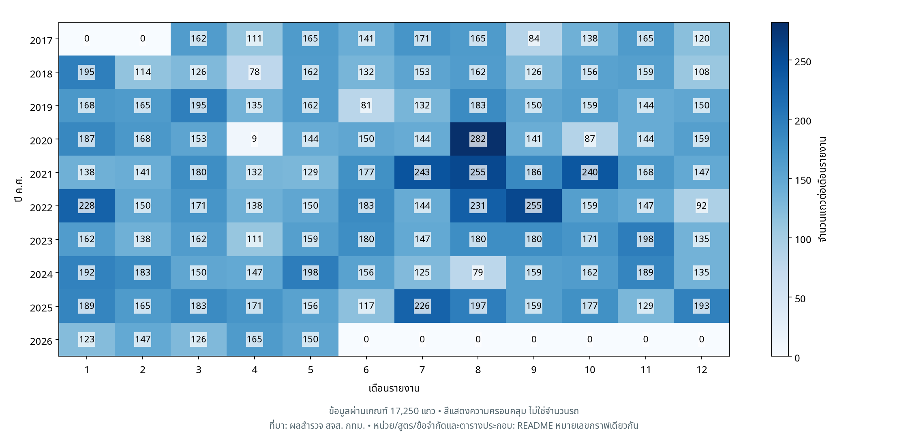
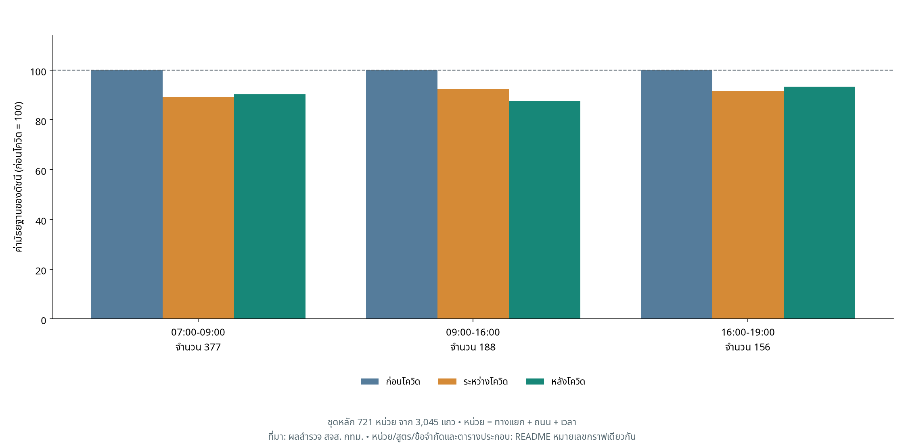
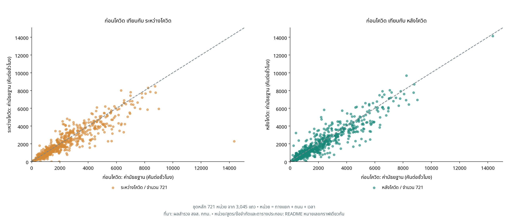
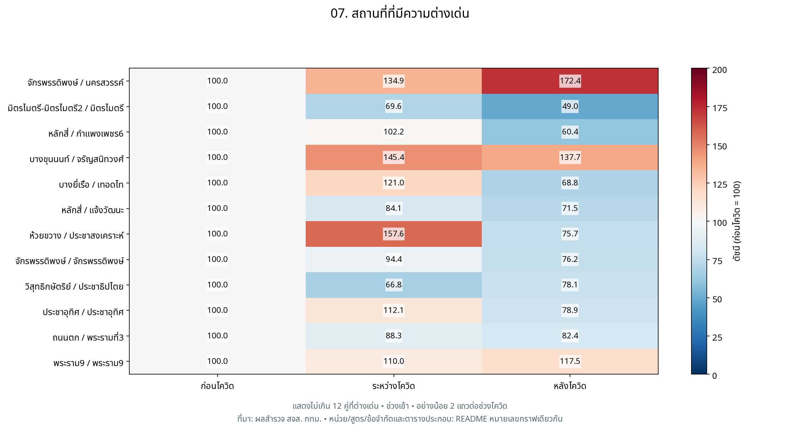
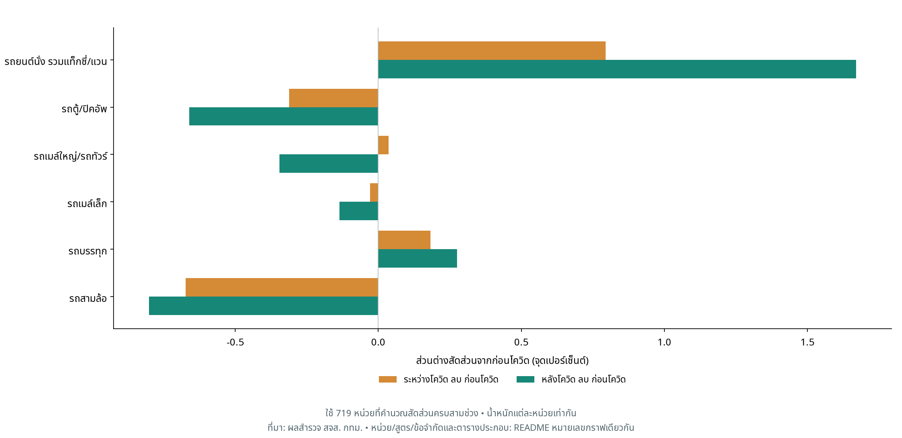
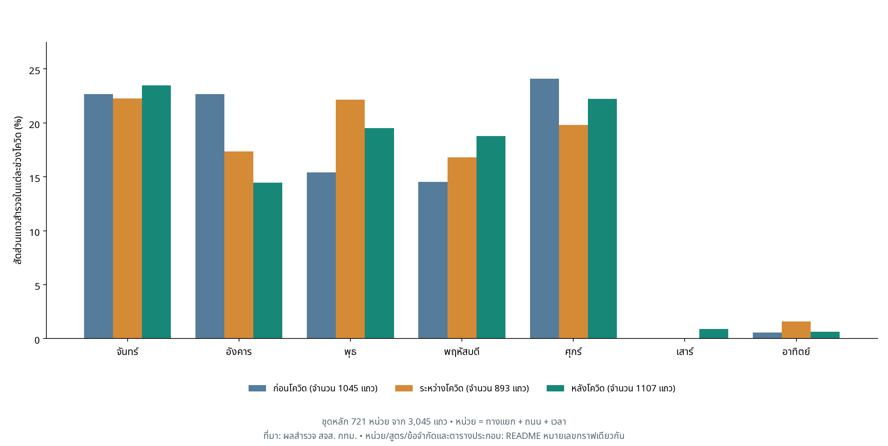

# DADS5001 — BKK Flow

## การศึกษาปริมาณการจราจรบริเวณทางแยกในกรุงเทพมหานคร ก่อน ระหว่าง และหลังโควิด-19
**ผู้จัดทำ:** 
1. ธนัชชา ละครพล     6820422006
2. พรภัสสร พัฒนไพบูลย์ 6820422010
3. อภัสรา แข็งเขตต์     6820422016
  
**GitHub:** [https://github.com/Aphatsara-Khangkhet/DADS5001-BKK-Flow](https://github.com/Aphatsara-Khangkhet/DADS5001-BKK-Flow)  

ข้อมูลที่ใช้: `bangkok_traffic_2560_2568 .xlsx` ชีต `traffic_data` วันที่สำรวจ 2017-03-01 ถึง 2026-05-29 (วัน–เดือน–ปีที่แสดงในตารางใช้ ค.ศ.) 

## ที่มาและขอบเขต

โครงงานนี้เริ่มจากความสนใจว่าปริมาณการจราจรบริเวณทางแยกในกรุงเทพมหานครแตกต่างกันอย่างไรในช่วงก่อน ระหว่าง และหลังการระบาดของโควิด-19 โดยต้องการสำรวจว่าปริมาณรถในช่วงระหว่างโควิดเปลี่ยนแปลงจากระดับก่อนโควิดอย่างไร และในช่วงหลังโควิดกลับมาใกล้เคียงระดับเดิมหรือไม่ รวมทั้งการเปลี่ยนแปลงดังกล่าวมีรูปแบบเหมือนหรือต่างกันในแต่ละสถานที่ จึงนำข้อมูลจำนวนรถที่ผ่านจุดสำรวจจากรายงานปริมาณจราจรบริเวณทางแยกของสำนักการจราจรและขนส่ง กรุงเทพมหานคร มาวิเคราะห์เปรียบเทียบสถานที่ ถนน และช่วงเวลาเดียวกันระหว่างสามช่วง เพื่ออธิบายรูปแบบการเปลี่ยนแปลงของปริมาณรถในชุดข้อมูล ทั้งนี้ การศึกษามุ่งสำรวจความแตกต่างระหว่างช่วงเวลา โดยยังไม่สามารถสรุปได้ว่าโควิด-19 เป็นสาเหตุของความแตกต่างทั้งหมด
สำนักการจราจรและขนส่ง กรุงเทพมหานครเผยแพร่ [รายงานปริมาณจราจรบริเวณทางแยก](https://traffic.bangkok.go.th/re_intersection/intersection/intersection.html) แยกตามเดือน งานนี้นำไฟล์ที่รวบรวมจากรายงานมาทำการวิเคราะห์ข้อมูลเชิงสำรวจด้วยเพื่อเปรียบเทียบปริมาณรถของหน่วยเดิมและสำรวจความต่างรายสถานที่/ประเภทรถ ใช้ `covid_period` ตามไฟล์เป็นเกณฑ์จัดกลุ่ม
| ช่วง | ชื่อในไฟล์ | ขอบเขตการเล่าในรายงาน |
| --- | --- | --- |
| ก่อนโควิด | ก่อนโควิด | ปี 2017–2019; ไม่รวม 2016 |
| ระหว่างโควิด | โควิด | ปี 2020–2021 |
| หลังโควิด | หลังโควิด | ปี 2022 จนถึงวันล่าสุดในไฟล์ ไม่ใช่ข้อมูลครบปีล่าสุด |

ข้อมูลเป็น **จำนวนรถที่ผ่านจุดสำรวจในช่วงเวลาที่ระบุ** มีหกหมวด ได้แก่ รถยนต์นั่ง รถตู้/ปิคอัพ รถเมล์ใหญ่ รถเมล์เล็ก รถบรรทุก และรถสามล้อ ตามฟิลด์ที่รวบรวมมา ไม่มีข้อมูลความเร็ว ระยะเวลาเดินทาง จำนวนผู้โดยสาร จักรยานยนต์ หรือจุดหมายการเดินทาง จึงตอบเรื่องปริมาณรถในชุดสำรวจ ไม่ใช่ระดับรถติดหรือพฤติกรรมคนทั้งกรุงเทพฯ นิยามหมวดย่อยและบริบทงานสำรวจอ่านประกอบได้จาก [คู่มือ สจส. หน้าเอกสาร 133–137](https://traffic.bangkok.go.th/TechnicalManuals/TTD.pdf#page=139) แต่คู่มือไม่ได้ยืนยันเหตุผลเลือกสำรวจทุกจุดในไฟล์นี้

## คำถาม–สมมติฐาน–หลักฐาน–ข้อสรุป

สมมติฐานด้านล่างเป็นแนวทางสำรวจ ไม่ใช่ผลทดสอบนัยสำคัญทางสถิติ

| คำถาม | สมมติฐานที่ตรวจ | หลักฐาน | ข้อสรุปที่ข้อมูลรองรับ |
| --- | --- | --- | --- |
| หน่วยเดิมเปลี่ยนในสามช่วงอย่างไร | ค่ากลางระหว่างและหลังต่ำกว่าก่อน | กราฟ 2: ก่อนโควิด 100 → ระหว่างโควิด 91.5 → หลังโควิด 90.2 | จำนวน 721 หน่วย | รองรับเชิงพรรณนาในชุดจับคู่ ไม่ใช่ทุกพื้นที่ |
| ทุกหน่วยกลับถึงฐานเหมือนกันหรือไม่ | หน่วยมีรูปแบบเพิ่ม/ลดต่างกัน | กราฟ 4–5: หลังโควิด มี 250/721 หน่วย (34.7%) ที่ไม่น้อยกว่าฐาน | ความต่างรายหน่วยสำคัญ ค่ากลางแทนทุกจุดไม่ได้ |
| สัดส่วนรถเหมือนเดิมหรือไม่ | หมวดรถยนต์นั่งมีสัดส่วนสูงขึ้น | กราฟ 10–11: รถยนต์รวมแท็กซี่: 71.72% → 72.51% → 73.39% | จำนวน 719 | สัดส่วนในหกหมวดเปลี่ยน ไม่ยืนยันการเปลี่ยนวิธีเดินทาง |
| กลุ่มล็อกดาวน์ต่างจากกลุ่มอื่นหรือไม่ | ปริมาณต่ำกว่าในหน่วยที่จับคู่ได้ | กราฟ 12: ดัชนี 85.7; ป้ายต่างจากกรอบวันที่ 168 แถว | ผลสำรวจเบื้องต้น ขึ้นกับนิยามและองค์ประกอบวัน |
| ผลไวต่อการจับคู่ปฏิทินหรือไม่ | การเพิ่มเงื่อนไขวันอาจเปลี่ยนขนาดผล | กราฟ 13: จำนวน 721: ระหว่างโควิด 91.5, หลังโควิด 90.2; จำนวน 76: ระหว่างโควิด 87.7, หลังโควิด 87.3; จำนวน 18: ระหว่างโควิด 87.3, หลังโควิด 94.1 | ขนาดผลและจำนวนตัวอย่างเปลี่ยน ต้องรายงานทั้งสองอย่าง |

## ข้อมูลพร้อมใช้แค่ไหน และคำนวณอย่างไร

| ขั้นตอน | จำนวน | ความหมาย |
| --- | ---: | --- |
| แถวดิบ | 17,440 | แถวจากชีต traffic_data |
| ผ่านเกณฑ์เบื้องต้น | 17,250 | หลังคัดปัญหาที่ระบุใน audit |
| แถวในชุดจับคู่หลัก | 3,045 | แถวของหน่วยที่มีครบสามช่วง |
| หน่วยจับคู่หลัก | 721 | ทางแยก + ถนน + ช่วงเวลา ไม่ใช่จำนวนแยก |
| ทางแยกในชุดจับคู่ | 204 | แยกเดียวอาจมีหลายถนน/เวลา |

ดู [Data Feasibility และ Matching Audit](docs/audit.md) และ [แถวในชุดจับคู่](tables/matched_observations.csv) เพื่อย้อนกลับไปวันที่และเลขแถว Excel ค่าว่าง/ขีดในหมวดรถแทนศูนย์ตามข้อตกลง แต่วันหรือสถานที่ที่ไม่มีการสำรวจจะไม่ถูกสร้างเป็นศูนย์ แถวซ้ำที่มีปัญหาและค่าจำนวนรถที่ไม่เหมาะสมถูกแยกก่อนคำนวณ ไม่ควรนำจำนวนกลุ่มปัญหาที่ซ้อนกันมาบวกเป็นแถวตัดออกซ้ำ

สูตรหลัก: **คันต่อชั่วโมง = ผลรวมรถหกหมวด ÷ ชั่วโมงสำรวจ** → หาค่ามัธยฐานรายหน่วยในแต่ละช่วง → **ดัชนี = ค่าระหว่างหรือหลัง ÷ ค่าก่อนของหน่วยเดียวกัน × 100** → สรุปค่ามัธยฐานดัชนีข้ามหน่วยที่จับคู่ครบและฐานเป็นบวก ค่ามัธยฐานคือค่ากลางเมื่อเรียงข้อมูล ไม่ใช่ผลรวมหารจำนวนซึ่งเรียกว่าค่าเฉลี่ย

## กราฟและคำอธิบายตามลำดับ

### กราฟ 1 — ข้อมูลครอบคลุมวันใดบ้าง

กราฟแสดงจำนวนรายการสำรวจการจราจรที่ผ่านเกณฑ์ตรวจสอบเบื้องต้น แยกตามปีและเดือนรายงาน โดยสีเข้มหมายถึงมีรายการสำรวจมาก และสีอ่อนหมายถึงมีรายการสำรวจน้อย ตัวเลขในแต่ละช่องเป็นจำนวนแถวข้อมูล ไม่ใช่จำนวนรถ เนื่องจากการสำรวจหนึ่งวันอาจมีหลายทางแยก หลายถนน และหลายช่วงเวลา

จุดที่เห็นชัดคือเดือนเมษายน 2020 มีข้อมูลเพียง 9 แถว ซึ่งอยู่ในเดือนที่คาบเกี่ยวกับมาตรการปิดสถานที่ในกรุงเทพมหานครช่วง 22 มีนาคม–12 เมษายน 2020 ตามรายงานของไทยโพสต์ มาตรการดังกล่าวเป็นบริบทสำคัญที่ควรนำมาพิจารณาในการศึกษาการเดินทาง อย่างไรก็ตาม ข่าวนี้ยังไม่ยืนยันสาเหตุที่จำนวนรายการสำรวจในไฟล์มีน้อย และกราฟนี้เพียงอย่างเดียวไม่สามารถบอกได้ว่าปริมาณรถลดลงเท่าไร [ไทยโพสต์](https://www.thaipost.net/main/detail/60470)

นอกจากนี้ ปี 2017 ไม่มีรายการในเดือนมกราคมและกุมภาพันธ์ ส่วนปี 2026 มีรายการเฉพาะเดือนมกราคมถึงพฤษภาคม ค่า 0 จึงหมายถึงไม่มีรายการในชุดข้อมูลที่นำมาวิเคราะห์ ไม่ใช่จำนวนรถเป็นศูนย์ ความครอบคลุมที่ต่างกันทำให้ไม่ควรนำยอดรถรวมรายปีมาเปรียบเทียบโดยตรง งานนี้จึงเลือกเปรียบเทียบทางแยก ถนน และช่วงเวลาเดียวกัน พร้อมปรับจำนวนรถเป็นคันต่อชั่วโมง ก่อนพิจารณาการเปลี่ยนแปลงระหว่างช่วงก่อน ระหว่าง และหลังโควิด

### กราฟ 2.1 - time series รถแต่ละประเภท

กราฟ Overall Traffic Volume Time Series Trend by Vehicle Type แสดงแนวโน้มปริมาณการจราจรเฉลี่ยของยานพาหนะทั้ง 6 ประเภทตั้งแต่อดีตจนถึงปัจจุบัน กราฟนี้ใช้แกน Y แบบ Logarithmic Scale (สเกลลอการิทึม) เพื่อให้สามารถเปรียบเทียบรถที่มีปริมาณมหาศาล (หลักพันคัน) ร่วมกับรถที่มีปริมาณน้อย (หลักสิบ-หลักร้อยคัน) ได้ในภาพเดียวอย่างชัดเจน

บทวิเคราะห์และข้อค้นพบสำคัญ (Key Findings)
1. รถยนต์นั่งส่วนบุคคล (Passenger Car) ครองความเป็นจ้าวถนน (เส้นสีแดงด้านบนสุด)

แนวโน้ม: รถยนต์นั่งส่วนบุคคล (Passenger Car) มีปริมาณสูงสุดอย่างเด่นชัดตลอดเวลา โดยรักษาระดับอยู่ที่ประมาณ 3,000 - 5,000 คัน

นัยสำคัญ: สะท้อนว่าคนกรุงเทพฯ ยังคงพึ่งพารถยนต์ส่วนตัวเป็นหลักในการเดินทาง แม้จะมีระบบขนส่งสาธารณะก็ตาม การเปลี่ยนแปลงของเส้นกราฟนี้แม้เพียงเล็กน้อย ก็ส่งผลต่อความหนาแน่นของการจราจรโดยรวมอย่างมหาศาล

2. กลุ่มรถเพื่อการพาณิชย์และขนส่งคงที่ (Pickup/Van และ Truck)

Pickup/Van (เส้นประสีส้ม): เป็นยานพาหนะที่มีปริมาณรองลงมา อยู่ในระดับ 1,000 - 2,000 คัน

Truck (เส้นประ-จุด สีม่วง): อยู่ในระดับ 100 - 200 คัน

แนวโน้ม: เส้นกราฟของทั้งสองประเภทค่อนข้างคงที่และขนานกัน สะท้อนถึงกิจกรรมทางเศรษฐกิจ การขนส่งสินค้า และโลจิสติกส์พื้นฐานที่ต้องดำเนินไปอย่างต่อเนื่องตามปกติ

3. ความซบเซาของระบบขนส่งสาธารณะ (Large Bus และ Small Bus)

Large Bus (เส้นประสีเขียวอ่อน) และ Small Bus (เส้นประสีเขียวเข้ม): มีปริมาณน้อยมากเมื่อเทียบกับกลุ่มอื่น (หลักสิบถึงหลักร้อยต้นๆ)

แนวโน้ม: เส้นกราฟค่อนข้างแบนราบ หรือมีแนวโน้มลดลงในบางช่วง (ผันผวนอยู่ด้านล่างสุดของกราฟ) แสดงให้เห็นว่าไม่มีการเติบโตในการใช้งานระบบขนส่งมวลชนบนท้องถนนเท่าที่ควร ซึ่งอาจเป็นผลมาจากการที่ประชาชนเปลี่ยนไปใช้ระบบราง (รถไฟฟ้า) หรือซื้อรถยนต์ส่วนตัวมากขึ้น

4. กลุ่มรถรับจ้างขนาดเล็ก (Tuk-Tuk)

Tuk-Tuk (เส้นทึบสีน้ำเงิน): มีแนวโน้มคล้ายคลึงกับรถบัส คืออยู่ในระดับ 100 คันบวกลบ

แนวโน้ม: ค่อนข้างทรงตัว ไม่มีการเติบโตที่โดดเด่น สะท้อนว่าตุ๊กตุ๊กกลายเป็นยานพาหนะสำหรับการเดินทางระยะสั้นเฉพาะจุด หรือกลุ่มนักท่องเที่ยว มากกว่าจะเป็นตัวเลือกหลักในการเดินทางของคนทั่วไป
### กราฟ 2.2 - แนวโน้มปริมาณรถทุกประเภทรวมกันเฉลี่ยรายปี (2560 - ปัจจุบัน)
https://colab.research.google.com/gist/thanutcha6639-beep/4db2f845c4020b8eaa29ebbef5183607/untitled10.ipynb#scrollTo=fr9qNQzxaD2A&fullscreenOutput=true

กราฟแสดงค่าเฉลี่ยของปริมาณรถรวมในแต่ละปี โดยพื้นที่เงารอบเส้นแสดงค่าคลาดเคลื่อนมาตรฐานของค่าเฉลี่ย (±1 SEM) ผลการวิเคราะห์พบว่าปริมาณรถเฉลี่ยมีความผันผวนตลอดช่วงเวลาที่ศึกษา โดยอยู่ในระดับค่อนข้างสูงในปี 2017 และ 2019 ก่อนปรับลดลงต่อเนื่องในช่วงปี 2020-2022 จากนั้นเพิ่มขึ้นในปี 2023 ลดลงต่ำสุดในปี 2024 และปรับเพิ่มขึ้นอีกครั้งในปี 2025 ก่อนเปลี่ยนแปลงเพียงเล็กน้อยในปี 2026 เมื่อพิจารณาภาพรวม ปริมาณรถเฉลี่ยหลังปี 2020 ยังอยู่ต่ำกว่าระดับที่พบในช่วงปี 2017-2019 อย่างไรก็ตาม การเปรียบเทียบรายปีควรพิจารณาจำนวนรายการข้อมูล สถานที่ และช่วงเวลาที่สำรวจร่วมด้วย เนื่องจากความแตกต่างของความครอบคลุมข้อมูลอาจมีผลต่อค่าเฉลี่ยที่ปรากฏในกราฟ
### กราฟ 3 - การเปลี่ยนแปลงปริมาณการจราจรช่วงเช้าในกรุงเทพมหานคร ระหว่างก่อนโควิด-19 (2017-2019) และหลังโควิด-19 (2022-2024)

แผนที่แสดงค่ามัธยฐานของการเปลี่ยนแปลงปริมาณการจราจรช่วงเช้าในแต่ละเขต โดยเปรียบเทียบข้อมูลหลังโควิด-19 ระหว่างปี 2022-2024 กับข้อมูลก่อนโควิด-19 ระหว่างปี 2017-2019 ผลการวิเคราะห์พบว่า เขตส่วนใหญ่มีปริมาณการจราจรลดลง โดยเขตบางพลัดมีค่าลดลงมากที่สุดร้อยละ 34.6 รองลงมาคือเขตสัมพันธวงศ์และเขตพญาไท ซึ่งลดลงร้อยละ 30.6 และ 22.5 ตามลำดับ ขณะที่เขตดินแดงมีปริมาณการจราจรเพิ่มขึ้นร้อยละ 9.2 ส่วนเขตสวนหลวงเพิ่มขึ้นสูงถึงร้อยละ 249.3 อย่างไรก็ตาม เขตสวนหลวงมีข้อมูลที่จับคู่ได้เพียง 3 คู่ ค่าที่เพิ่มขึ้นดังกล่าวจึงอาจได้รับอิทธิพลจากจำนวนข้อมูลที่น้อยหรือค่าผิดปกติ และควรตรวจสอบข้อมูลรายจุดเพิ่มเติมก่อนนำไปสรุปผล

### กราฟ 4 - การเปลี่ยนแปลงปริมาณการจราจรช่วงระหว่างวันในกรุงเทพมหานคร ระหว่างก่อนโควิด-19 (2017-2019) และหลังโควิด-19 (2022-2024)

แผนที่แสดงค่ามัธยฐานของการเปลี่ยนแปลงปริมาณการจราจรช่วงระหว่างวันในแต่ละเขต เมื่อเปรียบเทียบระหว่างช่วงก่อนและหลังโควิด-19 พบว่า เขตส่วนใหญ่มีปริมาณการจราจรลดลง โดยเขตสวนหลวงมีค่าลดลงมากที่สุดร้อยละ 53.9 รองลงมาคือเขตบางพลัดและเขตพระนคร ซึ่งลดลงร้อยละ 33.8 และ 22.1 ตามลำดับ ขณะที่เขตส่วนใหญ่ที่เหลือมีการลดลงในระดับไม่เกินร้อยละ 15 สำหรับเขตที่มีปริมาณการจราจรเพิ่มขึ้น พบว่าเขตห้วยขวางเพิ่มขึ้นมากที่สุดร้อยละ 11.5 รองลงมาคือเขตบึงกุ่ม ซึ่งเพิ่มขึ้นร้อยละ 6.7 อย่างไรก็ตาม เขตสวนหลวง เขตบึงกุ่ม และเขตห้วยขวางมีข้อมูลที่จับคู่ได้เพียงเขตละ 3 คู่ จึงควรตีความค่าการเปลี่ยนแปลงของเขตเหล่านี้ด้วยความระมัดระวัง

### กราฟ 5 - การเปลี่ยนแปลงปริมาณการจราจรช่วงเย็นในกรุงเทพมหานคร ระหว่างก่อนโควิด-19 (2017-2019) และหลังโควิด-19 (2022-2024)

แผนที่แสดงค่ามัธยฐานของการเปลี่ยนแปลงปริมาณการจราจรช่วงเย็นในแต่ละเขต โดยพบว่า เขตที่นำมาวิเคราะห์ส่วนใหญ่มีปริมาณการจราจรลดลงหลังโควิด-19 เขตบางพลัดมีค่าลดลงมากที่สุดร้อยละ 33.7 รองลงมาคือเขตธนบุรีและเขตบึงกุ่ม ซึ่งลดลงร้อยละ 23.9 และ 19.3 ตามลำดับ นอกจากนี้ เขตป้อมปราบศัตรูพ่าย คลองสาน และดุสิตมีปริมาณการจราจรลดลงมากกว่าร้อยละ 15 ในทางตรงกันข้าม เขตบางรักและเขตราชเทวีมีปริมาณการจราจรเพิ่มขึ้นร้อยละ 6.7 และ 5.5 ตามลำดับ ส่วนเขตจตุจักร ห้วยขวาง และบางแคมีการเปลี่ยนแปลงไม่เกินร้อยละ 5 ซึ่งสะท้อนว่าปริมาณการจราจรช่วงเย็นของพื้นที่ดังกล่าวค่อนข้างใกล้เคียงกับช่วงก่อนโควิด-19

### กราฟ 6 - ทางแยกที่มีปริมาณรถเฉลี่ยสูงสุดและต่ำสุด

กราฟเปรียบเทียบทางแยก 5 แห่งที่มีปริมาณรถรวมเฉลี่ยสูงสุดและ 5 แห่งที่มีค่าเฉลี่ยต่ำสุด โดยกลุ่มที่มีค่าเฉลี่ยสูงสุดอยู่ระหว่างประมาณ 32,947-42,258 คัน และทางแยกบรมราชชนนี-ราชพฤกษ์มีค่าสูงสุดประมาณ 42,258 คัน ขณะที่กลุ่มที่มีค่าเฉลี่ยต่ำสุดอยู่ระหว่างประมาณ 34-131 คัน ความแตกต่างระหว่างสองกลุ่มมีขนาดสูงมาก จึงอาจไม่ได้สะท้อนความหนาแน่นของการจราจรเพียงอย่างเดียว แต่อาจเกี่ยวข้องกับหน่วยข้อมูล ระยะเวลาสำรวจ จำนวนช่องทาง จำนวนครั้งที่สำรวจ หรือรายการข้อมูลที่ผิดปกติ ดังนั้น การจัดอันดับควรใช้ข้อมูลที่มีเงื่อนไขการสำรวจใกล้เคียงกันและตรวจสอบจำนวนรายการข้อมูลของแต่ละทางแยกประกอบ

### กราฟ 7 — การเปลี่ยนแปลงปริมาณรถจำแนกตามช่วงเวลาสำรวจ

กราฟแสดงค่ามัธยฐานของดัชนีปริมาณรถในช่วงเช้า กลางวัน และเย็น โดยปรับจำนวนรถเป็นคันต่อชั่วโมงก่อนคำนวณดัชนี และกำหนดฐานก่อนโควิดเท่ากับ 100 แต่ละกลุ่มมีหน่วยสำรวจ 377, 188 และ 156 หน่วย ตามลำดับ
พบว่าทั้งสามกลุ่มมีค่าดัชนีระหว่างและหลังโควิดต่ำกว่าฐานก่อนโควิด โดยช่วงหลังโควิด กลุ่มเช้าและเย็นมีดัชนีสูงขึ้นเล็กน้อยจากช่วงระหว่างโควิด ขณะที่กลุ่มกลางวันลดลงเพิ่มเติม
อย่างไรก็ตาม แต่ละกลุ่มมีชุดสถานที่สำรวจต่างกัน จึงยังสรุปไม่ได้ว่าความแตกต่างเกิดจากช่วงเวลาเพียงอย่างเดียว หรือผู้เดินทางเปลี่ยนจากช่วงหนึ่งไปอีกช่วงหนึ่ง

### กราฟ 8 - การเปรียบเทียบการเปลี่ยนแปลงของปริมาณการจราจร ณ จุดสำรวจเดิม จำแนกตามช่วงเวลาของวัน

กราฟแสดงค่ามัธยฐานของการเปลี่ยนแปลงปริมาณรถ ณ จุดสำรวจเดิมในช่วงเช้า ช่วงระหว่างวัน และช่วงเย็น โดยเปรียบเทียบช่วงระหว่างโควิด-19 (มีนาคม 2020-2021) และช่วงหลังโควิด-19 (2022-2024) กับช่วงก่อนโควิด-19 (2017-2019) ค่าติดลบหมายถึงปริมาณรถต่ำกว่าช่วงก่อนโควิด-19

ผลการวิเคราะห์พบว่า ในช่วงโควิด-19 ปริมาณรถลดลงในทุกช่วงของวัน โดยช่วงเช้าลดลงมากที่สุดร้อยละ 10.8 รองลงมาคือช่วงเย็นร้อยละ 9.6 และช่วงระหว่างวันร้อยละ 8.7 ส่วนช่วงหลังโควิด-19 ปริมาณรถยังคงต่ำกว่าช่วงก่อนโควิด-19 แต่ระดับการลดลงน้อยลง โดยช่วงเช้าลดลงร้อยละ 6.6 ช่วงเย็นลดลงร้อยละ 8.1 และช่วงระหว่างวันลดลงร้อยละ 8.3

เมื่อเปรียบเทียบระหว่างช่วงโควิด-19 กับช่วงหลังโควิด-19 พบว่า ปริมาณรถช่วงเช้ามีการปรับกลับมากที่สุด โดยค่าการเปลี่ยนแปลงดีขึ้น 4.2 จุดร้อยละ รองลงมาคือช่วงเย็นซึ่งดีขึ้น 1.5 จุดร้อยละ ขณะที่ช่วงระหว่างวันเปลี่ยนแปลงเพียง 0.4 จุดร้อยละ ผลดังกล่าวสะท้อนว่าปริมาณการจราจรหลังโควิด-19 เริ่มปรับกลับเข้าใกล้ระดับก่อนโควิด-19 โดยเฉพาะในช่วงเช้า แต่ยังไม่กลับสู่ระดับเดิมอย่างสมบูรณ์ในทุกช่วงของวัน

การวิเคราะห์นี้ใช้ข้อมูลจากคู่ทางแยกและถนนเดิมจำนวน 291 คู่ ซึ่งมีข้อมูลครบทั้งสามช่วงของวันและทั้งสามระยะของสถานการณ์โควิด-19 โดยปรับจำนวนรถให้อยู่ในหน่วยคันต่อชั่วโมงก่อนคำนวณ อย่างไรก็ตาม เวลาเริ่มต้นและสิ้นสุดการสำรวจในช่วงระหว่างวันและช่วงเย็นอาจแตกต่างกันบางปี ผลลัพธ์จึงควรตีความในเชิงเปรียบเทียบของชุดข้อมูลที่สำรวจ และไม่ควรสรุปว่าความแตกต่างทั้งหมดเกิดจากสถานการณ์โควิด-19 โดยตรง

### กราฟ 9 - ดัชนีปริมาณรถตามเงื่อนไขการจับคู่ข้อมูล (ตัวอย่าง)

กราฟนำเสนอแนวคิดการเปรียบเทียบดัชนีปริมาณรถภายใต้เงื่อนไขการจับคู่ข้อมูล โดยกำหนดให้ค่าก่อนโควิด-19 เท่ากับ 100 ดัชนีที่ต่ำกว่า 100 จึงหมายถึงปริมาณรถในช่วงเปรียบเทียบต่ำกว่าค่าฐาน ตัวอย่างเช่น ดัชนี 91.6 แสดงว่าค่ากึ่งกลางต่ำกว่าฐานร้อยละ 8.4 การเพิ่มเงื่อนไขการจับคู่สถานที่ เวลา และไตรมาสช่วยแสดงว่าผลลัพธ์อาจเปลี่ยนแปลงตามวิธีคัดเลือกข้อมูล อย่างไรก็ตาม ค่าดัชนีและจำนวนตัวอย่างที่แสดงในกราฟนี้เป็นค่าที่กำหนดไว้เพื่อสาธิตวิธีวิเคราะห์ มิได้คำนวณจากข้อมูลต้นฉบับในขั้นตอนดังกล่าว จึงควรสร้างกราฟใหม่จากข้อมูลจริงก่อนนำตัวเลขไปใช้เป็นผลการศึกษา
หมายเหตุ: กราฟนี้แสดงตัวอย่างแนวทางการวิเคราะห์ ตัวเลขยังไม่ใช่ผลการศึกษาขั้นสุดท้าย

### กราฟ 10 - Boxplot (Distribution of Traffic Volume by COVID Period)

สรุปผลการวิเคราะห์ Boxplot
ค่ามัธยฐาน (Median):

Before COVID (ก่อนโควิด): มีค่ามัธยฐานของปริมาณการจราจรสูงที่สุดอยู่ที่ระดับประมาณ 5,142 คัน ซึ่งสะท้อนถึงภาวะการเดินทางและสภาพการจราจรปกติก่อนเกิดโรคระบาด
During COVID (ช่วงโควิด): ค่ามัธยฐานลดลงมาอยู่ที่ประมาณ 4,351 คัน ซึ่งเป็นผลโดยตรงจากมาตรการล็อกดาวน์ การจำกัดการเดินทาง และนโยบายการทำงานจากที่บ้าน (WFH)
After COVID (หลังโควิด): ค่ามัธยฐานอยู่ที่ประมาณ 3,629 คัน ซึ่งอาจสะท้อนถึงการปรับเปลี่ยนพฤติกรรมระยะยาวของประชาชน (เช่น การ Work From Home บางส่วน หรือการเหลื่อมเวลาทำงาน) แม้สถานการณ์จะคลี่คลายแล้วก็ตาม
การกระจายตัวและความกว้างของกล่อง (Dispersion & Interquartile Range):
ช่วง Before COVID มีการกระจายตัวของข้อมูลกว้างที่สุด (ช่วงระหว่างควอไทล์กว้าง) บ่งบอกถึงความหลากหลายและความหนาแน่นของการจราจรในแต่ละจุดสำรวจที่มีความแตกต่างกันสูงมาก
ในขณะที่ช่วง During COVID และ After COVID ขอบเขตการกระจายตัวมีความแคบลง แสดงถึงปริมาณรถในจุดสำรวจส่วนใหญ่เริ่มมีความใกล้เคียงกันมากขึ้นในช่วงที่มีข้อจำกัดทางสังคม
ค่าผิดปกติ (Outliers):
ทั้งสามช่วงเวลาปรากฏจุดหมุดสีดำ (Outliers) ที่อยู่เหนือเส้นขอบบน (Upper Whisker) เป็นจำนวนมาก โดยเฉพาะในช่วง Before และ After COVID ซึ่งหมายถึง จุดสำรวจหรือทางแยกที่มีปริมาณการจราจรหนาแน่นสูงเป็นพิเศษ (เช่น ถนนสายหลักหรือจุดตัดสำคัญในกรุงเทพฯ) ที่มักมีปริมาณรถพุ่งสูงเกินกว่าค่าเฉลี่ยปกติของภาพรวมทั้งหมด

### กราฟ 11 — แต่ละหน่วยอยู่เหนือหรือต่ำกว่าฐาน

กราฟแสดงการเปรียบเทียบปริมาณจราจรของแต่ละหน่วยทางแยก–ถนน–เวลา โดยใช้ค่าก่อนโควิดเป็นฐาน เส้นประแสดงระดับที่ปริมาณจราจรเท่ากับก่อนโควิด จุดที่อยู่ต่ำกว่าเส้นหมายถึงปริมาณจราจรลดลง ส่วนจุดเหนือเส้นหมายถึงเพิ่มขึ้น จาก 721 หน่วย พบว่าระหว่างโควิด 64.5% และหลังโควิด 65.3% มีปริมาณจราจรต่ำกว่าฐาน แสดงให้เห็นว่าแม้หน่วยส่วนใหญ่มีปริมาณลดลง แต่การเปลี่ยนแปลงไม่ได้เกิดขึ้นในทิศทางเดียวกันทุกพื้นที่

### กราฟ 12 — สถานที่ที่มีการเปลี่ยนแปลงปริมาณรถเด่นชัด

กราฟแสดงดัชนีปริมาณรถช่วง 07:00–09:00 น. ของคู่ทางแยก–ถนน 12 คู่ ที่มีข้อมูลอย่างน้อยสองรายการต่อช่วงโควิด โดยเลือกคู่ที่มีดัชนีหลังโควิดต่างจากฐาน 100 มากที่สุด สีแดงหมายถึงสูงกว่าฐานก่อนโควิด ส่วนสีฟ้าหมายถึงต่ำกว่าฐาน

พบการเปลี่ยนแปลงต่างกันชัดเจน เช่น จักรพรรดิพงษ์–นครสวรรค์ มีดัชนีหลังโควิด 172.4 หรือสูงกว่าฐาน 72.4% ขณะที่มิตรไมตรี–มิตรไมตรี2 บนถนนมิตรไมตรี อยู่ที่ 49.0 หรือต่ำกว่าฐาน 51.0% ส่วนห้วยขวาง–ประชาสงเคราะห์ เพิ่มขึ้นระหว่างโควิด ก่อนลดต่ำกว่าฐานในช่วงหลังโควิด

ผลนี้ช่วยเลือกสถานที่สำหรับตรวจสอบวันสำรวจและประเภทรถเพิ่มเติม โดยทั้ง 12 คู่เป็นกรณีที่คัดจากความต่างเด่น ไม่ใช่ตัวแทนทั้งเมือง และสีแดงไม่ได้หมายถึงรถติดมากกว่า
### กราฟ 13 - ปริมาณรถเฉลี่ยจำแนกตามช่วงโควิด-19 และสถานะการล็อกดาวน์

กราฟแสดงปริมาณรถเฉลี่ยจำแนกตามช่วงสถานการณ์โควิด-19 และสถานะการล็อกดาวน์ โดยปริมาณรถเฉลี่ยรวมลดลงจาก 7,927.1 คันในช่วงก่อนโควิด-19 เหลือ 6,961.0 คันในช่วงโควิด-19 คิดเป็นการลดลงประมาณร้อยละ 12.2 และลดลงเหลือ 6,641.8 คันในช่วงหลังโควิด-19 หรือต่ำกว่าช่วงก่อนโควิด-19 ประมาณร้อยละ 16.2 นอกจากนี้ ช่วงล็อกดาวน์มีปริมาณรถเฉลี่ย 6,806.5 คัน ซึ่งต่ำกว่าช่วงที่ไม่มีการล็อกดาวน์ที่มีค่าเฉลี่ย 7,088.9 คันประมาณร้อยละ 4.0 อย่างไรก็ตาม ความแตกต่างดังกล่าวอาจได้รับอิทธิพลจากจำนวนสถานที่ ช่วงเวลา ฤดูกาล และความครอบคลุมของข้อมูลที่ไม่เท่ากัน จึงยังไม่สามารถสรุปได้โดยตรงว่าการลดลงทั้งหมดเกิดจากมาตรการล็อกดาวน์

### กราฟที่ 14 สัดส่วนประเภทรถจำแนกตามช่วงโควิด-19 และสถานะการล็อกดาวน์

กราฟแสดงสัดส่วนของรถแต่ละประเภทในรูปแบบแท่งซ้อนร้อยละ 100 โดยกราฟด้านซ้ายเปรียบเทียบช่วงก่อน ระหว่าง และหลังโควิด-19 ส่วนกราฟด้านขวาเปรียบเทียบช่วงล็อกดาวน์กับช่วงที่ไม่มีการล็อกดาวน์ รถยนต์นั่งส่วนบุคคลมีสัดส่วนสูงสุดประมาณร้อยละ 70.2-71.9 รองลงมาคือรถกระบะและรถตู้ประมาณร้อยละ 23.0-24.6 ขณะที่รถประเภทอื่นมีสัดส่วนค่อนข้างน้อย ผลดังกล่าวแสดงว่าโครงสร้างของประเภทรถโดยรวมมีการเปลี่ยนแปลงไม่มากระหว่างกลุ่ม อย่างไรก็ตาม กราฟนี้แสดงสัดส่วน มิใช่จำนวนรถทั้งหมด จึงควรพิจารณาร่วมกับกราฟปริมาณรถเฉลี่ยเพื่อประเมินการเปลี่ยนแปลงของระดับการจราจร

### กราฟ 15 - แผนภูมิความร้อน (Heatmap หรือ Traffic Volume Density Heatmap) Traffic Volumn Density Heatmaps by COVID Period & Lockdown Status

สรุปผลการวิเคราะห์ข้อมูลการจราจรจากกราฟ Heatmap ทั้งสองมุมมอง 
สรุปสาระสำคัญรถเก๋งครองพื้นที่ถนนมากที่สุด: ในทุกสภาวะ รถยนต์ส่วนบุคคล (Passenger Car) มีปริมาณสูงที่สุดแบบทิ้งห่างประเภทอื่นอย่างเห็นได้ชัด (~4,600–5,500 คัน) 
รองลงมาคือรถกระบะ/ตู้ (~1,600–1,900 คัน)   
แนวโน้มช่วงโควิด (ภาพ A - โทนสีฟ้า): ปริมาณรถรวมค่อยๆ ลดลงต่อเนื่องตั้งแตียุค ก่อนโควิด ----> ระหว่างโควิด -----> หลังโควิด   
ผลของมาตรการล็อกดาวน์ (ภาพ B - โทนสีส้ม): ช่วงล็อกดาวน์ส่งผลให้ปริมาณรถทุกประเภทบนท้องถนนลดลงเมื่อเทียบกับช่วงไม่ล็อกดาวน์อย่างชัดเจน  
ขนส่งสาธารณะสัดส่วนน้อยมาก: รถเมล์ใหญ่ รถเมล์เล็ก รถตุ๊กตุ๊ก และรถบรรทุก มีปริมาณน้อยมาก (หนาแน่นเพียงหลักสิบถึงร้อยต้นๆ) ในทุกสถานการณ์ 
    
### กราฟ 16 — Diverging Bar Chart (กราฟแท่งแนวนอนแสดงส่วนต่างสองฝั่ง) ระหว่างการเปลี่ยนแปลงสัดส่วนรถแต่ละประเภทเทียบกับก่อนโควิด

คำนวณหาว่ารถแต่ละประเภทคิดเป็นกี่เปอร์เซ็นต์ของปริมาณรถทั้งหมดในช่วงเวลานั้นๆ:

"สัดส่วน (%)"=(("ปริมาณรถประเภท " i)/"ปริมาณรถรวมทุกประเภท" )×100

ช่วงระหว่างโควิด (แท่งสีส้ม):

Δ〖"Share" 〗_"During" =〖"Share" 〗_"During" -〖"Share" 〗_"Before" 

ช่วงหลังโควิด (แท่งสีเขียว):

Δ〖"Share" 〗_"After" =〖"Share" 〗_"After" -〖"Share" 〗_"Before" 

	เส้นตรงกลาง (เลข 0): คือระดับสัดส่วนช่วงก่อนโควิด (ใช้เป็นจุดอ้างอิง) 
	แท่งยื่นไปทางขวา (> 0): สัดส่วนรถประเภทนั้นบนถนน เพิ่มขึ้น
	แท่งยื่นไปทางซ้าย (< 0): สัดส่วนรถประเภทนั้นบนถนน ลดลง
	สีส้ม: ช่วงระหว่างโควิด | สีเขียว: ช่วงหลังโควิด 

สรุปสาระสำคัญจากกราฟ
	รถยนต์นั่ง (เพิ่มขึ้นสูงที่สุด):
	แท่งสีเขียวยื่นไปทางขวายาวที่สุด (+1.67 จุดเปอร์เซ็นต์) แสดงว่าหลังโควิด คนหันมาขับรถส่วนตัวและใช้รถเก๋ง/แท็กซี่บนถนนมากกว่าช่วงก่อนโควิดอย่างเห็นได้ชัด 
	รถสามล้อ (ตุ๊กตุ๊ก) และ รถตู้/ปิ๊กอัพ (สัดส่วนลดลงมากที่สุด):
	แท่งยื่นไปทางซ้ายลึกที่สุดทั้งช่วงระหว่างโควิดและหลังโควิด สะท้อนว่าสัดส่วนการวิ่งบนถนนหายไปเยอะที่สุด 
	รถบรรทุก (เพิ่มขึ้นเล็กน้อยสม่ำเสมอ):
	แท่งยื่นไปทางขวาทั้งสองช่วง สอดคล้องกับการเติบโตของภาคการขนส่งสินค้าและโลจิสติกส์ 
	รถเมล์เล็กและรถเมล์ใหญ่ (สัดส่วนลดลง):
	ในช่วงหลังโควิด (สีเขียว) รถเมล์ทั้งสองขนาดยื่นไปทางซ้ายทั้งหมด แสดงถึงสัดส่วนรถขนส่งสาธารณะบนท้องถนนที่ลดลงเมื่อเทียบกับยุคก่อนโควิด

### กราฟ 17 — กราฟแท่งแบบจัดกลุ่ม" (Grouped Bar Chart หรือ Clustered Column Chart) ที่แสดง "การกระจายความถี่เชิงสัดส่วนร้อยละ" (Relative Frequency Distribution)

ทั้งนี้ กราฟแสดงสัดส่วนรายการสำรวจ ไม่ใช่ปริมาณรถ จึงใช้บอกไม่ได้ว่าวันใดรถมากหรือรถติดกว่า และยังไม่ได้แยกวันหยุดหรือเทศกาล ดังนั้นแท่งที่สูงแปลว่า "มีจำนวนแถวข้อมูลสำรวจในวันนั้นเยอะ" ไม่ได้แปลว่าวันนั้นรถติดกว่าวันอื่น
2 สาระสำคัญสรุปแบบเข้าใจง่าย:
1.	ข้อมูลเกือบทั้งหมดมาจาก "วันธรรมดา (จันทร์–ศุกร์)"
	ข้อมูลมากกว่า 95% ถูกเก็บในวันทำงาน โดยเฉพาะวันจันทร์และศุกร์มีสัดส่วนการเก็บข้อมูลสูงที่สุด 
	วันเสาร์และอาทิตย์ มีข้อมูลเก็บมาน้อยมากจนแทบเป็นศูนย์ 
2.	สัดส่วนวันเก็บข้อมูลของทั้ง 3 ช่วงเวลา "ไม่ตรงกันเป๊ะ"
	ช่วงก่อนโควิด (สีน้ำเงิน): เน้นเก็บข้อมูลวันจันทร์, อังคาร และศุกร์ 
	ช่วงระหว่างโควิด (สีส้ม): สัดส่วนวันอังคารลดลง แต่ไปหนักวันพุธแทน 
	ช่วงหลังโควิด (สีเขียว): สัดส่วนวันอังคารลดลงเหลือต่ำสุด แต่ไปเพิ่มขึ้นในวันพุธ, พฤหัสบดี และศุกร์ 

### สรุป Action plan กราฟ Bubble Chart (แผนภูมิบับเบิล) ที่ถูกนำมาสร้างเป็น Strategic Action Priority Matrix (เมทริกซ์จัดลำดับความสำคัญเชิง стратеги) แบบ 2x2 Quadrant คือเมทริกซ์การจัดลำดับความสำคัญเชิงนโยบาย 
### ซึ่งเปลี่ยนข้อมูลพฤติกรรมการเดินทางหลังโควิดให้กลายเป็น แผนปฏิบัติการ (Action Plan) ที่นำไปใช้งานได้จริง โดยแบ่งการวิเคราะห์ออกเป็น 2 แกนหลัก และ 4 กลุ่มนโยบาย ดังนี้

1. โครงสร้างและการอ่านแกนของกราฟ
แกน X (Current Traffic Volume): ปริมาณรถเฉลี่ยในปัจจุบัน (หลังโควิด) บอกถึง "ขนาดของปัญหา (Impact)" ยิ่งอยู่ขวา ยิ่งส่งผลต่อความหนาแน่นบนท้องถนนสูง
แกน Y (Rebound Rate %): อัตราการฟื้นตัวเทียบกับก่อนโควิด (100% = ปริมาณเท่ากับยุคก่อนโควิด) บอกถึง "แนวโน้มและความเร่งด่วน (Urgency)" ยิ่งอยู่สูง แปลว่าการเดินทางรูปแบบนั้นกลับมาเร็วหรือมากกว่าปกติ

2. สรุปผลการวิเคราะห์แบ่งตามกลุ่มรถ (Vehicle Insights)

🟢 1. กลุ่มฟื้นฟูและสนับสนุน (ซ้ายล่าง)
รถในกลุ่ม: Small Bus (ฟื้นตัว ~40%), Tuk-Tuk (ฟื้นตัว ~60%), Large Bus (ฟื้นตัว ~70%)
บทวิเคราะห์: กลุ่มระบบขนส่งสาธารณะและรถรับจ้างขนาดเล็กมีอัตราการฟื้นตัวต่ำสุดอย่างเห็นได้ชัด ปริมาณการใช้งานยังไม่กลับมาเท่าช่วงก่อนโควิด สะท้อนว่าประชาชนเปลี่ยนไปใช้รถส่วนบุคคลแทน
Action Plan: ต้องอุดหนุนและฟื้นฟู (Subsidies & System Upgrades) เช่น ลดค่าโดยสาร เพิ่มคุณภาพรถ ปรับปรุงเส้นทางเชื่อมต่อ เพื่อจูงใจให้ประชาชนกลับมาใช้ขนส่งสาธารณะ

🔵 2. กลุ่มจัดการประสิทธิภาพ (ขวาล่าง)
รถในกลุ่ม: Passenger Car (รถยนต์ส่วนบุคคล ~4,700 คัน), Pickup/Van (~1,600 คัน)
บทวิเคราะห์: เป็นกลุ่มหลักที่สร้างปริมาณจราจรบนท้องถนน (Volume สูงมาก) แม้อัตราการฟื้นตัวจะอยู่ที่ประมาณ 85% (ยังไม่ถึง 100%) แต่ด้วยปริมาณตั้งต้นที่สูงมาก จึงเป็นสาเหตุหลักของรถติด
Action Plan: เน้นการบริหารจัดการจุดฝืด (Bottleneck Fixes & Smart Signals) เช่น ใช้ระบบไฟจราจรอัจฉริยะ AI ควบคุมตามความหนาแน่นจริง การแก้ปัญหากายภาพถนน และการจัดการช่องจราจร

🟠 3. กลุ่มเฝ้าระวังและจัดระเบียบ (ซ้ายบน)
รถในกลุ่ม: Truck มีอัตราการฟื้นตัวเกิน 100% แต่ปริมาณรวมยังน้อย (จุดวงกลมสีฟ้าด้านบนสุด)
บทวิเคราะห์: มีพฤติกรรมการใช้งานเพิ่มสูงขึ้นกว่าช่วงก่อนโควิดอย่างชัดเจน แม้ปัจจุบันปริมาณยังไม่สร้างปัญหาใหญ่ แต่มีแนวโน้มเติบโตต่อเนื่อง
Action Plan: เฝ้าระวังและจัดระเบียบ (Zoning & Time Restrictions) เช่น การกำหนดเวลาวิ่ง หรือจำกัดโซนการใช้งานก่อนที่จะสะสมจนกลายเป็นปัญหาใหญ่

🔴 4. กลุ่มควบคุมด่วน (ขวาบน)
บทวิเคราะห์: ยานพาหนะที่มีทั้งปริมาณมหาศาลและอัตราฟื้นตัวเกิน 100% (ปัจจุบันยังไม่มีประเภทใดหลุดเข้ามาในโซนนี้อย่างเต็มตัว)
Action Plan: หากมีรถกลุ่มใดขยับเข้าโซนนี้ ต้องใช้นโยบายขั้นเด็ดขาด เช่น เก็บค่าธรรมเนียมรถติด (Congestion Fees) หรือจำกัดวันการวิ่งตามเลขทะเบียน

ข้อเสนอแนะภาพรวม
จุดเน้นย้ำที่สำคัญที่สุดจากการศึกษานี้คือ "วิกฤตระบบขนส่งสาธารณะ" (กลุ่มสีเขียวฟ้า) ที่ซบเซาลงอย่างมาก ควบคู่กับ "การพึ่งพารถยนต์นั่งส่วนบุคคล" (กลุ่มสีฟ้า) ที่ยังคงครองพื้นที่ถนนเกินกว่า 70% ของปริมาณจราจรทั้งหมด นโยบายเร่งด่วนจึงไม่ใช่อย่างใดอย่างหนึ่ง แต่คือการ "ดึงคนกลับสู่ระบบราง/บัส (Support)" ควบคู่กับการ "ใช้นวัตกรรม AI บริหารจัดการรถยนต์บนถนน (Efficiency)"

## ปิดประเด็นตรวจข้อมูล: อะไรตรวจแล้ว อะไรยังยืนยันไม่ได้

**Lockdown:** ตรวจพบ 168 แถวที่ป้ายในไฟล์ต่างจากกรอบวันที่อ้างอิง โดยใช้วันที่สำรวจจริง แยกดังนี้

| เดือน | จำนวนแถว | วันแรก | วันสุดท้าย |
| --- | --- | --- | --- |
| 2020-03 | 120 | 2020-03-02 | 2020-03-20 |
| 2021-04 | 48 | 2021-04-01 | 2021-04-16 |

ในจำนวนนี้มี **29 แถวอยู่ในชุดจับคู่สามช่วง** และ **11 แถวอยู่ในชุดจับคู่ล็อกดาวน์ตามป้ายเดิม** จึงต้องแยกว่าป้ายมีปัญหากับการตีความล็อกดาวน์ ไม่ใช่เหตุให้แก้ covid_period หรือทิ้งทั้งแถวโดยอัตโนมัติ ดู [รายการระดับแถว](tables/lockdown_date_review.csv)

คงค่าจากไฟล์เป็นวิธีหลัก แล้วคำนวณวิธีอ้างอิงแยกในกราฟ 12: 22 มีนาคม–12 เมษายน 2020 และ 12 กรกฎาคม–30 กันยายน 2021 รวมวันเริ่ม/สิ้นสุดตามนิยามที่ผู้ใช้ให้ หลักฐาน [ไทยโพสต์](https://www.thaipost.net/main/detail/60470) รองรับช่วงปิดสถานที่ในปี 2020 ส่วน [BBC](https://www.bbc.com/thai/thailand-57773493) รองรับวันเริ่มมาตรการเดือนกรกฎาคม 2021 แต่ยังไม่ยืนยันวันสิ้นสุด 30 กันยายนจากแหล่งนี้ ช่วงประกาศสถานการณ์ฉุกเฉิน 26 มีนาคม–30 เมษายนที่ผู้ใช้ให้เป็นคนละนิยาม ไม่รวมกับการปิดสถานที่โดยอัตโนมัติ

**สถานะ:** ตรวจข้อเท็จจริงเรื่องวันที่และคำนวณผลเปรียบเทียบแล้ว แต่ยังไม่ยืนยันว่า 168 แถวเป็นการกรอกผิด เพราะต้องทราบกฎตั้งป้ายเดิมและประกาศที่ใช้ ห้ามเขียนว่าแก้ปัญหานี้เสร็จแล้วหรือว่าทุกวัน Not Lockdown ไม่มีมาตรการ

**ตรวจต้นทาง:** ได้เทียบข้อความตารางหน้า 1 ของรายงานมีนาคม 2020 กับ 6 แถวแรกของปากซอยพัฒนาการ53 วันที่ 2 มีนาคม 2020 โดยตรวจวันที่ เวลา และจำนวนรถทั้งหกหมวด; รายละเอียดอยู่ใน [บันทึกตรวจตัวอย่าง](docs/source_check.md) การตรวจนี้ไม่ครอบคลุมทุกแถวและยังไม่ใช่การตรวจภาพทุกหน้า

**สิทธิใช้ข้อมูล:** [บัญชีข้อมูลภาครัฐ](https://data.go.th/en/dataset/traffic_volume) ระบุข้อมูลสาธารณะและผู้ติดต่อเป็น สจส. แต่ช่อง License ระบุ “License not specified” ณ วันที่ตรวจ 19 กันยายน 2026 จึงยังไม่มีหลักฐานเพียงพอให้ยืนยันเงื่อนไขอนุญาตเผยแพร่ทุกส่วนตามเกณฑ์รายวิชา การเห็นลิงก์ดาวน์โหลดไม่เท่ากับสัญญาอนุญาตที่ระบุชัด ควรเก็บหลักฐานจากหน่วยงานหรือให้อาจารย์พิจารณาก่อนกล่าวว่าผ่านข้อนี้ ไม่ได้ติดต่อหน่วยงานแทนสมาชิก

**เงื่อนไขชุดข้อมูลที่มี tutorial แพร่หลาย:** การค้นเบื้องต้นด้วยชื่อชุดข้อมูลร่วมกับ Pandas, GitHub และ tutorial ยังไม่พบชุดบทสอนแพร่หลายที่ตรงกับไฟล์รวบรวมนี้ แต่เป็นการค้นจำกัด ไม่ใช่หลักฐานว่าไม่มีใครทำมาก่อนหรือรับรองว่าผ่านเกณฑ์ ต้องให้อาจารย์พิจารณาจากแหล่งและการรวบรวมจริง

## สรุปเพื่อปิดการนำเสนอ

“งานนี้เริ่มจากตรวจว่าข้อมูลคนละช่วงเปรียบเทียบกันได้แค่ไหน แล้วจึงจับคู่สถานที่ ถนน และเวลาเดิม ผลพบว่าค่ากลางต่ำกว่าฐานก่อนโควิด แต่สถานที่เปลี่ยนไม่เหมือนกัน และองค์ประกอบรถก็เปลี่ยนด้วย ข้อค้นพบช่วยเลือกจุดที่ควรสำรวจซ้ำและตรวจต้นทางเพิ่ม ยังใช้ฟันธงผลของโควิดหรือสั่งปรับสัญญาณไฟจากจำนวนรถเพียงอย่างเดียวไม่ได้”

ข้อเสนอแนะที่เชื่อมกับหลักฐาน:

1. จากกราฟ 4 และ 7: เลือกจุดเพิ่มและลดอย่างละกลุ่มเพื่อตรวจซ้ำ ห้ามใช้ค่ากลางเดียวแทนทุกแยก
2. จากกราฟ 8, 13, 14: วางแผนสำรวจสถานที่ เวลา เดือน และประเภทวันให้ใกล้เคียงกัน เพื่อเพิ่มความเทียบเคียง
3. จากกราฟ 9–11: เก็บข้อมูลผู้โดยสารและหมวดรถเพิ่มเติมก่อนอธิบายการเปลี่ยนวิธีเดินทาง
4. จากกราฟ 12: แยกปิดสถานที่ เคอร์ฟิว และสถานการณ์ฉุกเฉินเป็นนิยามที่ตรวจสอบได้ก่อนศึกษามาตรการ
5. ถ้าจะศึกษารถติดในอนาคต ต้องเพิ่มความเร็ว เวลาเดินทาง ความยาวแถวคอยหรือความจุถนน ไม่ใช้ปริมาณรถแทนความแออัดโดยตรง

   
## แหล่งอ้างอิงและบทบาทเครื่องมือ

- [รายงานผลสำรวจทางแยก สจส. กทม.](https://traffic.bangkok.go.th/re_intersection/intersection/intersection.html): แหล่งข้อมูลต้นทาง
- [คู่มือ สจส.](https://traffic.bangkok.go.th/TechnicalManuals/TTD.pdf#page=139): บริบทการสำรวจและหมวดรถ
- [บัญชีข้อมูลภาครัฐ](https://data.go.th/en/dataset/traffic_volume): หน่วยงานและสถานะ license ที่ตรวจพบ ไม่ได้ใช้อนุมานสิทธิจากแค่การเข้าถึงได้
- [ไทยโพสต์](https://www.thaipost.net/main/detail/60470): ช่วงปิดสถานที่ปี 2020
- [BBC](https://www.bbc.com/thai/thailand-57773493): บริบทวันเริ่มมาตรการกรกฎาคม 2021
- [FHWA Traffic Monitoring Guide](https://www.fhwa.dot.gov/policyinformation/tmguide/tmg_2022/traffic-data-methodologies.cfm): หลักพิจารณาความต่างของช่วงเวลาและฤดูกาล ไม่ใช่หลักฐานว่า สจส. ใช้วิธีเดียวกันทุกข้อ

**ขอบเขตรายวิชา:** เนื้อหาหลักเป็นการสำรวจข้อมูลจริง ทำความสะอาด จับคู่ สรุปสถิติ สร้างกราฟ และอธิบายข้อค้นพบด้วย Pandas/Matplotlib ไม่มีความจำเป็นต้องเพิ่ม machine learning หรืออ้างเหตุเชิงสาเหตุเพื่อทำให้งานดูซับซ้อน ขนาดข้อมูลเกิน 100 แถวและสมาชิกมี 3 คนแล้ว แต่เงื่อนไขสิทธิใช้ข้อมูลและความเหมาะสมเรื่อง tutorial ยังต้องมีหลักฐาน/การพิจารณาเพิ่ม จึงไม่รับรองว่าผ่านทุกเกณฑ์โดยอัตโนมัติ รูปแบบส่งงานในชุดนี้ใช้ GitHub README ตามที่ผู้ใช้แจ้งล่าสุด

