# คำอธิบายกราฟ Bangkok Traffic Mini Project

เอกสารนี้ใช้ประกอบรายงานและการนำเสนอ อ้างอิงข้อมูลฉบับร่าง `bangkok_traffic_2560_Present (NotFinal) (1).xlsx` ชีต `traffic_data` จำนวน 17,005 แถว ครอบคลุมมีนาคม 2017–พฤษภาคม 2026 ตัวเลขต้องคำนวณใหม่เมื่อปรับข้อมูล

## ที่มาและคำถามของโครงงาน

โครงงานศึกษาว่าปริมาณรถบริเวณทางแยกในกรุงเทพมหานครเปลี่ยนแปลงอย่างไรระหว่างก่อน ระหว่าง และหลังโควิด โดยใช้ `covid_period` จากไฟล์โดยตรง คำถามหลักคือปริมาณรถในสถานที่และเวลาเดียวกันกลับมาใกล้ระดับก่อนโควิดเพียงใด รวมถึงความแตกต่างระหว่างเช้า–เย็นและองค์ประกอบประเภทรถ

เนื่องจากสถานที่ เวลา และจำนวนครั้งสำรวจแต่ละปีไม่เท่ากัน จึงตรวจคุณภาพข้อมูลและจับคู่ทางแยก–ถนน–ช่วงเวลาก่อนเปรียบเทียบ ไม่ใช้ยอดรวมรายปีจากคนละชุดตัวอย่างแทนแนวโน้มการจราจร ผลเป็นการวิเคราะห์เชิงพรรณนา ไม่ยืนยันว่าโควิดเป็นสาเหตุ และไม่ใช้ปริมาณรถแทนความเร็วหรือความติดขัด ข้อมูลต้นทางเผยแพร่โดยสำนักการจราจรและขนส่ง กรุงเทพมหานคร ดูรายละเอียดแหล่งอ้างอิงด้านล่าง

## แหล่งที่มาของข้อมูลและแหล่งอ้างอิง

- **หน่วยงานเจ้าของข้อมูล:** สำนักการจราจรและขนส่ง กรุงเทพมหานคร
- **ชุดข้อมูล:** ปริมาณการจราจรบริเวณทางแยกในเขตกรุงเทพมหานคร
- **เว็บไซต์ต้นทาง:** [ปริมาณการจราจรบริเวณทางแยก](https://traffic.bangkok.go.th/re_intersection/intersection/intersection.html) เผยแพร่ข้อมูลรายเดือนตั้งแต่ พ.ศ. 2559 มีไฟล์ Excel/PDF ตามรายการ
- **วันที่ตรวจสอบหน้าเว็บไซต์ครั้งนี้:** 14 กันยายน 2026 ไม่ใช่วันที่ดาวน์โหลดไฟล์เดิม
- **ข้อมูลที่ใช้คำนวณจริง:** ไฟล์ที่ผู้ใช้รวบรวม `bangkok_traffic_2560_Present (NotFinal) (1).xlsx` ชีต `traffic_data` ขอบเขตมีนาคม 2017–พฤษภาคม 2026 ตัดปี 2016 ตามข้อตกลง ใช้ `covid_period` ในไฟล์โดยตรง
- **การตรวจย้อน:** ผลปัจจุบันอ้างอิงไฟล์รวมและ source_excel_row; ยังไม่ได้ตรวจเทียบทุกแถวกับไฟล์รายเดือนบนเว็บไซต์ จึงควรเพิ่มตารางเชื่อมชื่อไฟล์ต้นทาง เดือน URL และแถวในไฟล์รวมเมื่อจัดทำฉบับสมบูรณ์
- **งานตัวอย่างประกอบการวางโครงเรื่อง:** [Dads-5001-Accident-Is-You-Dont-Love](https://github.com/techasit239/Dads-5001-Accident-Is-You-Dont-Love) ใช้ศึกษาแนวทางนำเสนอ ไม่ใช่แหล่งข้อมูลจราจรที่ใช้คำนวณ

หน้าเว็บไซต์มีรายการกรกฎาคม 2026 แล้ว ณ วันที่ตรวจสอบ แต่ผลในเอกสารนี้ยังใช้ไฟล์เดิมถึงพฤษภาคม 2026 เท่านั้น ไม่ได้นำรายการใหม่มารวมโดยอัตโนมัติ

## วิธีอ่านร่วมกัน

- ปริมาณรถต่อชั่วโมง = จำนวนรถรวม 6 ประเภท ÷ ชั่วโมงสำรวจ
- หน่วยหลัก = ทางแยก + ถนน + ช่วงเวลาเริ่ม–สิ้นสุดเดียวกัน ทางแยกหนึ่งแห่งอาจมีหลายหน่วย
- ภายในแต่ละหน่วยและกลุ่มโควิด ใช้มัธยฐานปริมาณรถต่อชั่วโมง แล้วคำนวณดัชนีเทียบ Before ของหน่วยนั้น ก่อนหามัธยฐานดัชนีรวมโดยให้น้ำหนักทุกหน่วยเท่ากัน
- Before = 100; ดัชนี 90 หมายถึงต่ำกว่าฐาน 10% และ 110 หมายถึงสูงกว่าฐาน 10% หน่วยที่ฐานเป็นศูนย์ไม่คำนวณอัตราส่วน
- Date/month/year คือวันที่รายงาน ส่วน survey_date คือวันสำรวจจริง เก็บแยกกัน
- ช่องว่างและ `-` ของจำนวนรถแทนด้วย 0 ตามข้อตกลง แต่เดือนหรือสถานที่ที่ไม่ได้สำรวจไม่เติมเป็นปริมาณรถศูนย์

## กราฟ 1 — ผลเปรียบเทียบเมื่อเปลี่ยนเงื่อนไขการจับคู่

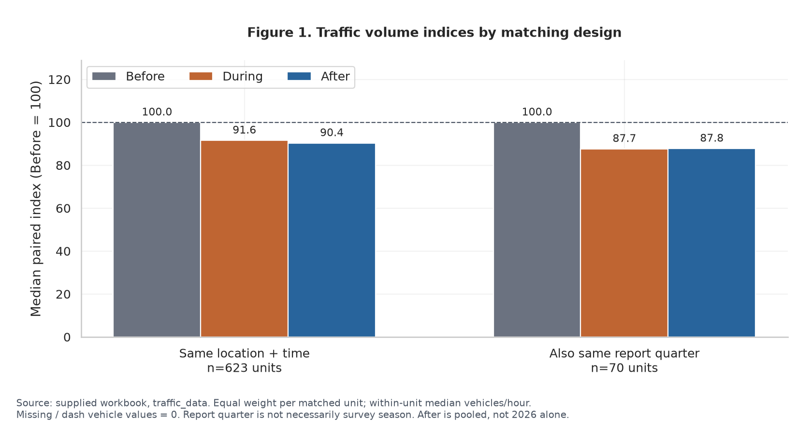

**คำถาม:** ข้อสรุปเปลี่ยนหรือไม่เมื่อจับคู่ข้อมูลให้เข้มงวดขึ้น?

**วิธีอ่าน:** เปรียบเทียบดัชนี Before, During และ After ภายใต้เงื่อนไขสถานที่–เวลาเดียวกัน และเงื่อนไขเพิ่มเติมเรื่องไตรมาสหรือเดือนเดียวกัน ค่า 100 คือฐานก่อนโควิด

**ผลที่พบ:** ชุดหลัก 623 หน่วยมีดัชนี During 91.6 และ After 90.4 เมื่อจับคู่ไตรมาสรายงานเดียวกันเหลือ 70 หน่วย ได้ 87.7 และ 87.8 ส่วนเดือนรายงานเดียวกันเหลือ 15 หน่วย ได้ 85.5 และ 96.1

**ความหมาย:** ขนาดการเปลี่ยนแปลงไวต่อเงื่อนไขและชุดตัวอย่าง จึงต้องแสดงจำนวนหน่วยควบคู่กับดัชนี ไม่เลือกเฉพาะผลที่ตรงสมมติฐาน

**ข้อจำกัด:** เงื่อนไขเข้มขึ้นทำให้ตัวอย่างลดลง และเดือนรายงานไม่จำเป็นต้องตรงกับเดือนสำรวจ การเปลี่ยนดัชนีระหว่างวิธีจึงไม่ได้พิสูจน์ผลของฤดูกาล

## กราฟ 2 — ปริมาณรถต่อชั่วโมงแยกตามช่วงเวลา

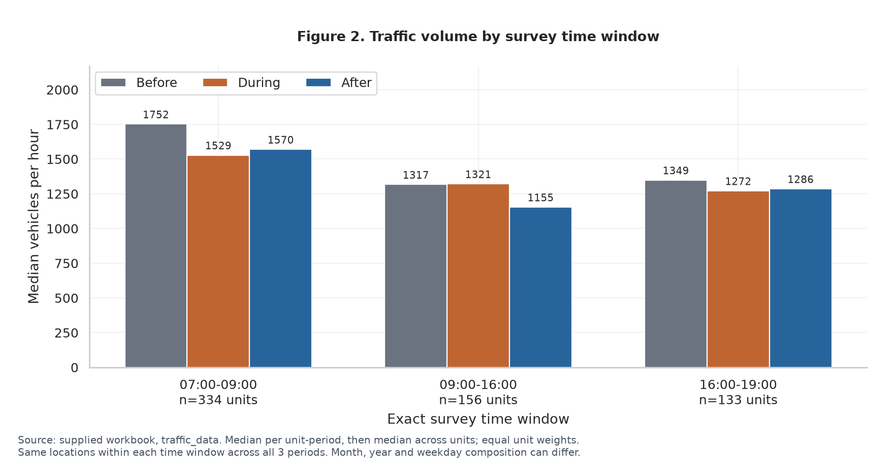

**คำถาม:** ปริมาณรถในแต่ละช่วงเวลาต่างกันอย่างไรระหว่างสามกลุ่มโควิด?

**วิธีอ่าน:** เปรียบเทียบค่ามัธยฐานคันต่อชั่วโมงของแต่ละกลุ่มภายในช่วงเวลาสำรวจเดียวกัน การหารด้วยชั่วโมงช่วยไม่ให้ยอดสะสมจากช่วงสำรวจยาวกว่าดูสูงกว่าเพียงเพราะระยะเวลา

**ความหมาย:** ใช้เห็นรูปแบบปริมาณรถตามช่วงเวลาและเลือกช่วงเวลาสำหรับศึกษาต่อ

**ข้อจำกัด:** สถานที่ในช่วงเช้ากับเย็นอาจไม่ใช่ชุดเดียวกัน จึงยังสรุปจากรูปนี้อย่างเดียวไม่ได้ว่าช่วงใดกลับสู่ฐานเดิมมากกว่า ให้ใช้กราฟ 7 สำหรับการเปรียบเทียบเช้า–เย็นแบบจับคู่สถานที่

## กราฟ 3 — ปริมาณรถก่อน–หลังโควิดรายหน่วย

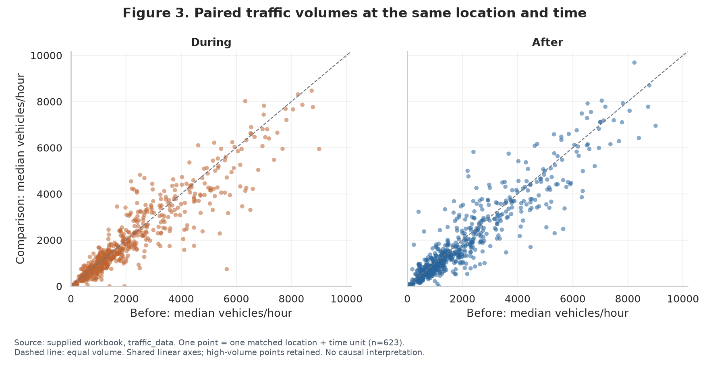

**คำถาม:** ทุกสถานที่เปลี่ยนไปในทิศทางเดียวกันหรือไม่?

**วิธีอ่าน:** แต่ละจุดคือหนึ่งหน่วยสถานที่–เวลา เปรียบเทียบค่าก่อนและหลังโควิด จุดบนเส้นเท่ากันหมายถึงปริมาณไม่เปลี่ยน จุดเหนือเส้นหมายถึงหลังโควิดสูงกว่า และใต้เส้นหมายถึงต่ำกว่า

**ผลที่พบ:** 35.3% ของหน่วยที่จับคู่ได้มีปริมาณรถ After ไม่น้อยกว่า Before

**ความหมาย:** แม้ค่ากลางรวมต่ำกว่าฐาน แต่บางหน่วยมีปริมาณเพิ่มขึ้น จึงควรตรวจรายสถานที่ก่อนเลือกกรณีศึกษาหรือเสนอให้ติดตาม

**ข้อจำกัด:** จุดหลายจุดอาจอยู่ทางแยกเดียวกัน จึงไม่ใช่ตัวอย่างอิสระทั้งหมด การจับคู่ชื่อยังไม่ได้ยืนยันด้วยพิกัด

## กราฟ 4 — สัดส่วนประเภทรถในแต่ละช่วงโควิด

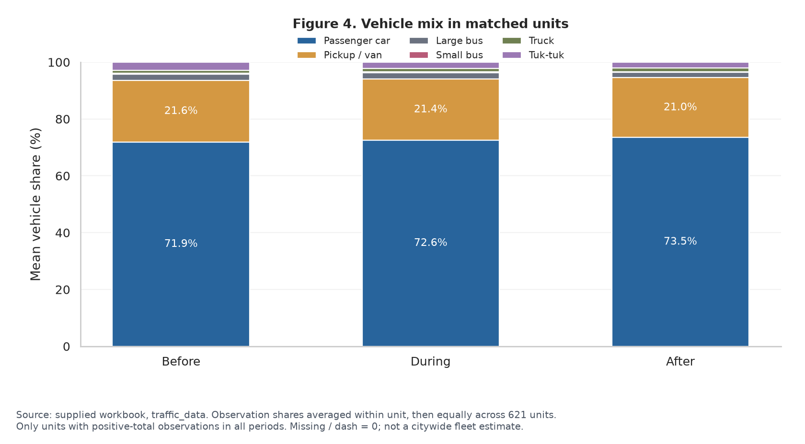

**คำถาม:** องค์ประกอบของรถที่สำรวจเปลี่ยนไปหรือไม่?

**วิธีอ่าน:** ส่วนสีแสดงสัดส่วนรถ 6 ประเภทในแต่ละกลุ่ม คำนวณสัดส่วนภายในหน่วยก่อนเฉลี่ยโดยให้น้ำหนักหน่วยเท่ากัน ไม่ใช่นำยอดรถทุกสถานที่มารวมแล้วหารครั้งเดียว

**ความหมาย:** แสดงภาพรวมองค์ประกอบรถในตัวอย่างที่จับคู่ได้ และใช้เป็นพื้นฐานของกราฟ 9 ที่ขยายความต่างของแต่ละประเภท

**ข้อจำกัด:** สัดส่วนเพิ่มไม่ได้แปลว่าจำนวนรถประเภทนั้นเพิ่ม เพราะประเภทอื่นอาจลดลง การแทนค่าว่างด้วยศูนย์กระทบสัดส่วนได้ และผลไม่ใช่สัดส่วนรถทั้งหมดของกรุงเทพฯ

## กราฟ 5 — ความครอบคลุมข้อมูลรายเดือนและปี

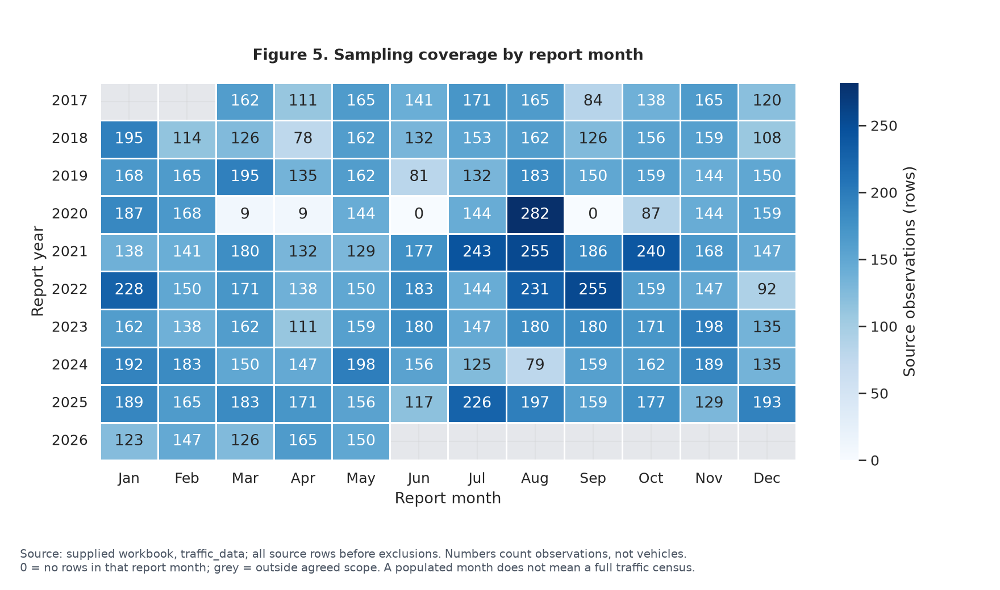

**คำถาม:** ข้อมูลแต่ละช่วงเวลาครบถ้วนและสม่ำเสมอเพียงใด?

**วิธีอ่าน:** แต่ละช่องคือเดือนและปีรายงาน สีแสดงจำนวนแถวข้อมูลทั้งหมด ไม่ใช่จำนวนรถ พื้นที่นอกขอบเขตมีนาคม 2017–พฤษภาคม 2026 แยกไว้ต่างหาก

**ความหมาย:** อธิบายเหตุผลที่ต้อง matching ก่อนเปรียบเทียบ เพราะข้อมูลแต่ละช่วงไม่ได้มีจำนวนเท่ากัน เหมาะใช้เปิดเรื่องก่อนแสดงผลการวิเคราะห์

**ข้อจำกัด:** มีแถวในเดือนหนึ่งไม่ได้หมายความว่าทุกสถานที่ถูกสำรวจครบ และไม่มีแถวไม่ได้หมายถึงไม่มีรถ

## กราฟ 6 — การกระจายของดัชนีปริมาณรถ

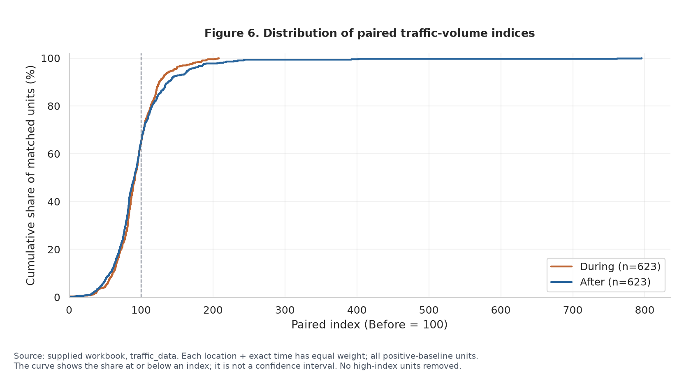

**คำถาม:** ค่ากลางสะท้อนหน่วยส่วนใหญ่ได้เพียงใด?

**วิธีอ่าน:** แกนนอนคือดัชนีเทียบ Before และแกนตั้งคือสัดส่วนสะสมของหน่วยที่มีดัชนีไม่เกินค่านั้น เส้นอ้างอิง 100 ช่วยแยกหน่วยที่ยังต่ำกว่าฐานกับหน่วยที่ถึงหรือสูงกว่าฐาน

**ผลที่พบ:** หน่วยที่ After ไม่น้อยกว่า Before มี 35.3% สอดคล้องกับกราฟ 3

**ความหมาย:** กราฟ 3 แสดงระดับปริมาณรถจริง ส่วนกราฟนี้แสดงการเปลี่ยนแปลงสัมพัทธ์ ทำให้เปรียบเทียบหน่วยที่มีฐานขนาดต่างกันได้ และเห็นการกระจายที่ค่ามัธยฐานซ่อนไว้

**ข้อจำกัด:** หน่วยจากทางแยกเดียวกันอาจสัมพันธ์กัน ดัชนีสูงมากอาจสัมพันธ์กับฐานเดิมที่ต่ำ ต้องตรวจค่าจริงประกอบ ไม่ตัดค่าสูงออกเพียงเพราะเป็น outlier

## กราฟ 7 — เช้าเทียบเย็นในสถานที่เดียวกัน

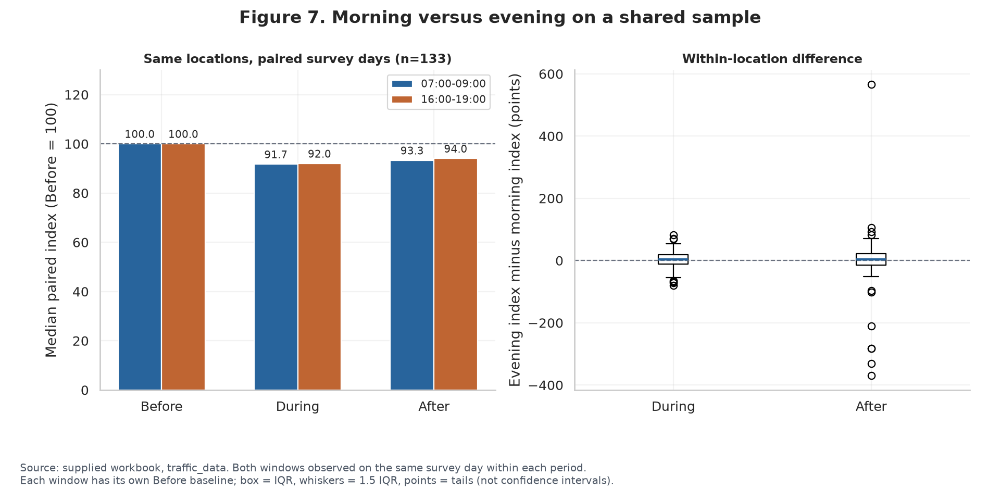

**คำถาม:** เช้าหรือเย็นกลับมาใกล้ระดับก่อนโควิดมากกว่ากัน?

**วิธีอ่าน:** ใช้ 133 คู่ทางแยก–ถนนที่จับคู่เช้า 07:00–09:00 กับเย็น 16:00–19:00 ในวันสำรวจเดียวกัน และมีข้อมูลครบสามกลุ่มโควิด แต่ละช่วงเวลาเทียบกับฐาน Before ของตนเอง ส่วนกราฟผลต่างคำนวณดัชนีเย็นลบเช้าทีละสถานที่ ค่าบวกหมายถึงเย็นมีดัชนีสูงกว่าเช้า

**ผลที่พบ:** มัธยฐานดัชนี After ช่วงเช้า 93.3 และเย็น 94.0 มัธยฐานผลต่างรายสถานที่เท่ากับ +3.42 จุดดัชนี ผลต่างนี้ไม่เท่ากับการนำมัธยฐานรวมสองค่ามาลบกัน เพราะลำดับการคำนวณต่างกัน

**ความหมาย:** ในตัวอย่างที่จับคู่ได้ ช่วงเย็นมีดัชนีเทียบฐานสูงกว่าเช้าเล็กน้อย เป็นการตอบคำถามเช้า–เย็นที่ตรงกว่ากราฟ 2

**ข้อจำกัด:** ไม่ได้ควบคุมเดือนและปีสำรวจระหว่างกลุ่มโควิดทั้งหมด และยังไม่ได้ทดสอบนัยสำคัญทางสถิติ จึงไม่สรุปสาเหตุของความต่าง

## กราฟ 8 — สถานที่ที่เปลี่ยนแปลงสูงและต่ำในช่วงเช้า

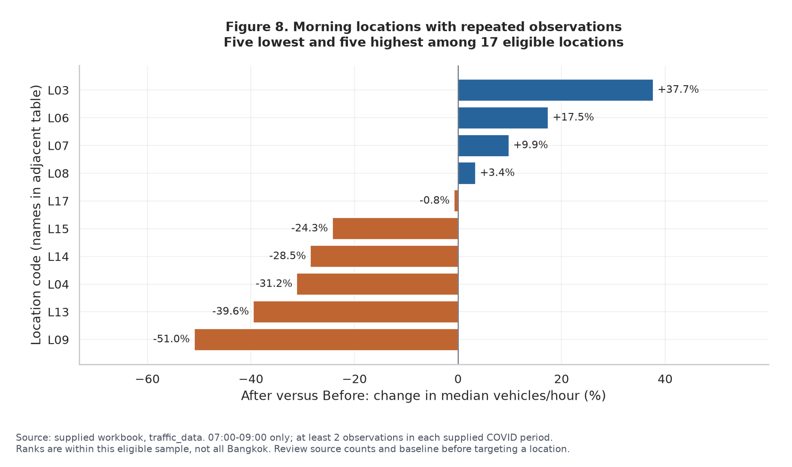

**คำถาม:** สถานที่ใดควรเลือกมาตรวจสอบหรือติดตามเพิ่มเติม?

**วิธีอ่าน:** ใช้เฉพาะ 07:00–09:00 และมีอย่างน้อย 2 รายการสำรวจในแต่ละกลุ่มโควิด ผ่านเกณฑ์ 17 คู่ทางแยก–ถนน แสดง 5 ค่าต่ำสุดและ 5 ค่าสูงสุดของเปอร์เซ็นต์เปลี่ยนแปลง After เทียบ Before รหัส L เชื่อมกับชื่อในตารางประกอบรายงานและ Notebook

**ผลที่พบ:** มิตรไมตรี–มิตรไมตรี 2 / ถนนมิตรไมตรี ลดประมาณ 51.0% ขณะที่บางขุนนนท์ / ถนนจรัญสนิทวงศ์ เพิ่มประมาณ 37.7%

**ความหมาย:** ช่วยเลือกกรณีศึกษาเพื่อตรวจบริบทและข้อมูลต้นทางเพิ่มเติม ห้าค่าสูงสุดไม่ได้หมายความว่าทั้งห้าค่าต้องเป็นบวก

**ข้อจำกัด:** เป็นอันดับเฉพาะ 17 คู่ที่ผ่านเกณฑ์ ไม่ใช่อันดับทั่วกรุงเทพฯ จำนวนครั้งสำรวจยังน้อย จึงไม่ใช้ผลนี้อย่างเดียวตัดสินเปลี่ยนสัญญาณไฟ

## กราฟ 9 — การเปลี่ยนแปลงสัดส่วนรถแต่ละประเภท

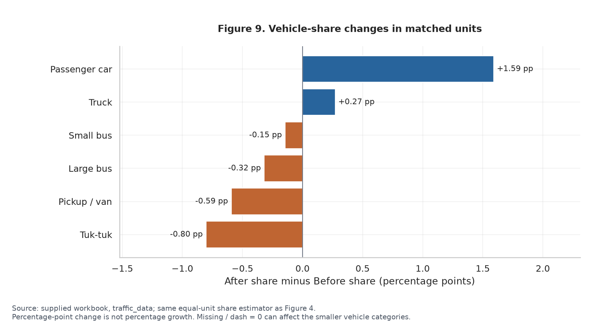

**คำถาม:** รถประเภทใดมีสัดส่วนเพิ่มหรือลดชัดเจน?

**วิธีอ่าน:** แท่งแสดงสัดส่วน After ลบ Before หน่วยเป็นจุดเปอร์เซ็นต์ เช่น 10% เป็น 12% คือเพิ่ม 2 จุดเปอร์เซ็นต์ ไม่ใช่เพิ่ม 2% ของค่าเดิม ค่าบวกแสดงสัดส่วนเพิ่ม และค่าลบแสดงสัดส่วนลด

**ผลที่พบ:** รถยนต์นั่งเพิ่ม 1.59 จุดเปอร์เซ็นต์ รถบรรทุกเพิ่ม 0.27 จุดเปอร์เซ็นต์ ส่วนตุ๊กตุ๊กลด 0.80 จุดเปอร์เซ็นต์

**ความหมาย:** ทำให้เห็นความต่างของประเภทรถที่มีสัดส่วนเล็กซึ่งอ่านยากในกราฟ 4

**ข้อจำกัด:** ยังสรุปไม่ได้ว่าผู้เดินทางเปลี่ยนจากขนส่งสาธารณะมาใช้รถส่วนตัว เพราะไม่มีข้อมูลระดับบุคคล และสมมติฐานค่าว่างเป็นศูนย์อาจมีผลต่อประเภทที่พบน้อย

## กราฟ 10 — ปี 2026 เทียบก่อนโควิดในเดือนเดียวกัน

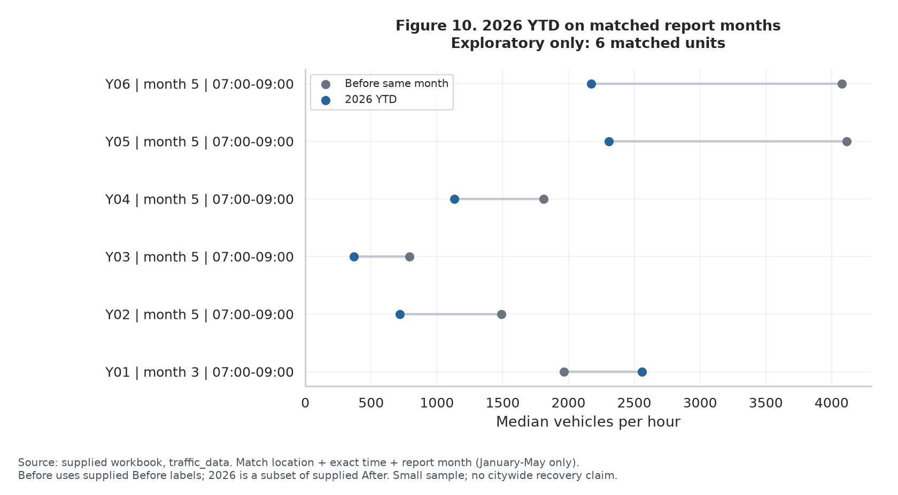

**คำถาม:** ข้อมูลปีล่าสุดบอกอะไรได้เมื่อเทียบสถานที่ เวลา และเดือนให้ตรงกัน?

**วิธีอ่าน:** จุดสองสีและเส้นเชื่อมแสดงคันต่อชั่วโมงของ Before กับปีรายงาน 2026 โดยจับคู่สถานที่ ช่วงเวลา และเดือนรายงานเดียวกัน รหัส Y เชื่อมกับชื่อสถานที่ในตารางประกอบ ใช้เฉพาะข้อมูลที่มีถึงพฤษภาคม ไม่เทียบยอดบางปีกับยอดเต็มปี

**ผลที่พบ:** จับคู่ได้ 6 หน่วย รวม 12 แถว มัธยฐานดัชนีเท่ากับ 54.7 แต่บางหน่วยสูงกว่าฐาน เช่น บางขุนนนท์ / จรัญสนิทวงศ์ ในเดือนมีนาคม

**ความหมาย:** แสดงหลักฐานที่มีจริงสำหรับปีล่าสุดและชี้จุดที่ควรเก็บข้อมูลเพิ่ม

**ข้อจำกัด:** เป็นตัวอย่างขนาดเล็กมากและจับคู่เดือนรายงาน ไม่ใช่ตัวแทนทั้งเมือง จึงไม่สรุปว่าปริมาณรถกรุงเทพฯ ปี 2026 ลดลงตามดัชนีนี้

## ลำดับแนะนำสำหรับนำเสนอ

ใช้กราฟ 5 → 1 → 3 → 7 → 9 → 8 เพื่อเล่าจากความพร้อมข้อมูล ไปสู่ผลรวม ความแตกต่างเชิงสถานที่และเวลา และกรณีที่ควรติดตาม กราฟที่เหลือใช้ประกอบคำถาม โดยเฉพาะกราฟ 10 สำหรับข้อจำกัดข้อมูลปีล่าสุด

ตัวเลขและตารางตรวจย้อน: [รายงาน EDA](outputs/eda/EDA_Findings.md) · [Notebook](notebooks/02_eda_and_visualization.ipynb) · [ผลการตรวจสอบ](outputs/eda/validation.json)

## ข้อเสนอแนะจากผลวิเคราะห์ทั้งหมด

ข้อเสนอต่อไปนี้เป็นแผนเดิม ปัจจุบันดำเนินการตรวจ bootstrap ค่าว่าง วันสำรวจ แยกปี และบริบทสถานที่แล้ว ดูผลตรวจเพิ่มเติมด้านล่าง ส่วนข้อมูล OD และคู่มือสำรวจยังต้องยืนยันเพิ่มเติม

### 1. ใช้ความแตกต่างรายสถานที่เป็นข้อค้นพบหลัก

หลักฐาน: ชุดหลักมีมัธยฐานดัชนี After 90.4 แต่ 35.3% ของหน่วยมี After ไม่น้อยกว่า Before จึงเสนอประเด็นหลักว่า “ปริมาณรถในตัวอย่างที่จับคู่ได้เปลี่ยนแปลงไม่เท่ากันระหว่างสถานที่และเวลา” เลือกตัวอย่างเพิ่มและลดจากกราฟ 8 แล้วตรวจวันสำรวจและข้อมูลต้นทางก่อนอธิบายบริบท ไม่เสนอให้ปรับสัญญาณไฟจากปริมาณรถอย่างเดียว

### 2. เพิ่มความไม่แน่นอนของผล มากกว่าจำนวนกราฟ

หลักฐาน: After เปลี่ยนจาก 90.4 ในชุดหลักเป็น 96.1 ในชุดเดือนตรงกัน ซึ่งเหลือเพียง 15 หน่วย ควรรายงานขนาดตัวอย่างทุกกราฟ และหากเพิ่มสถิติ ให้พิจารณา bootstrap โดยสุ่มเป็นกลุ่มทางแยกเพื่อรักษาความสัมพันธ์ของหลายถนนและช่วงเวลาในแยกเดียวกัน ช่วงความไม่แน่นอนดังกล่าวยังไม่แก้ปัญหาการเลือกสถานที่สำรวจและไม่พิสูจน์สาเหตุ

### 3. ตรวจความทนทานต่อสมมติฐานค่าว่างเป็นศูนย์

คงผลหลักตามข้อตกลงเดิมที่แทนช่องว่างและขีดด้วยศูนย์ แต่เพิ่มผลประกอบจากรายการที่มีตัวเลขครบก่อนแทนศูนย์ แล้วดูว่าดัชนีและสัดส่วนรถเปลี่ยนมากหรือไม่ ต้องแสดงจำนวนตัวอย่างที่ลดลงด้วย เพราะผลต่างอาจมาจากองค์ประกอบตัวอย่างที่เปลี่ยน ไม่ใช่สมมติฐานศูนย์เพียงอย่างเดียว

### 4. ติดตามเช้า–เย็นด้วยสถานที่และวันเดิม

หลักฐาน: 133 คู่สถานที่ให้มัธยฐานผลต่างดัชนี After เย็นลบเช้า +3.42 จุด จึงควรเก็บหรือคัดข้อมูลวันในสัปดาห์ เดือน และสถานที่เดิมให้ใกล้เคียงกันก่อนสรุปความต่างระหว่างช่วงเวลา ข้อเสนอเรื่องพฤติกรรมการเดินทางต้องมีข้อมูลการเดินทางหรือขนส่งสาธารณะเพิ่ม

### 5. แยกปีใน After เมื่อชุดเปรียบเทียบรองรับ

After รวมหลายปีจึงอาจซ่อนการเปลี่ยนแปลงภายในกลุ่ม ควรตรวจการจับคู่แต่ละปีกับฐาน Before บนสถานที่ เวลา และเดือนเดียวกันก่อน หากแต่ละปีใช้คนละชุด ให้แสดงแยกพร้อมจำนวนหน่วย ไม่ลากเส้นต่อกันเหมือนติดตามชุดเดียวตลอดเวลา ปัจจุบันไม่มีหน่วยที่มีครบทุกปีทั้งสิบปี

### 6. ให้ปี 2026 เป็นผลประกอบและวางแผนเพิ่มข้อมูล

หลักฐาน: กราฟล่าสุดมีเพียง 6 หน่วย แม้มัธยฐานดัชนีเป็น 54.7 ก็ยังใช้สรุปทั้งเมืองไม่ได้ ควรเพิ่มข้อมูลสถานที่และเดือนเดิม พร้อมพิจารณารายการใหม่จากต้นทางในรอบอัปเดตที่ระบุรุ่นข้อมูลชัดเจน แล้วรัน audit และ matching ใหม่ทั้งหมด

### 7. ก่อนส่งงานให้ครบทั้งหลักฐานและการสื่อสาร

เพิ่มตารางคำถาม–กราฟ–ข้อค้นพบ–ข้อจำกัด–ข้อเสนอแนะ พร้อมแหล่งข้อมูล วันที่เข้าถึง บทบาทสมาชิก และการใช้ AI เลือกประมาณ 6 กราฟสำหรับเล่าเรื่องหลัก ส่วนกราฟอื่นเป็นภาคผนวก ไม่จำเป็นต้องเพิ่มกราฟที่ตอบคำถามซ้ำ งานจะหนักแน่นขึ้นจากการตรวจย้อนและขอบเขตข้อสรุปที่ชัดเจน

## ผลตรวจเพิ่มเติมตามข้อเสนอ (14 กันยายน 2026)

**พบจุดที่ต้องทวนต้นทาง:** แถว Excel 704 มิตรไมตรี วันที่ 25 ก.ค. 2017 มี truck=0 และ tuk_tuk=0 แต่ PDF ต้นทางหน้า 6 ระบุ 32 และ 15 คัน ยอดต่าง 47 คัน ยังไม่แก้ไฟล์รวม ผลทั้งหมดจึงเป็นฉบับร่าง การตรวจ complete numeric ไม่สามารถตรวจค่าศูนย์ที่บันทึกผิดลักษณะนี้ได้

- Bootstrap ตามกลุ่มทางแยก 175 แห่ง 3,000 รอบ: During 91.6 (ช่วง percentile 95% 88.4–94.9), After 90.4 (86.6–93.8) เป็นความไม่แน่นอนภายใน sample ไม่ใช่ช่วงของ causal effect
- แถวตัวเลขครบเหลือ 440 หน่วย: After 91.1 ภาพรวมยังต่ำกว่าฐาน แต่ต้องคำนึงว่าชุดตัวอย่างลดลง
- จับคู่เพิ่มวันในสัปดาห์เหลือ 50 หน่วย; หากเพิ่มเดือนสำรวจด้วยเหลือ 0 หน่วยครบสามกลุ่ม จึงยังควบคุมปฏิทินได้ไม่ครบ
- ตรวจสิบคู่สถานที่ที่แสดงในกราฟ 8 ครบ 68 รายการ จาก 49 วันสำรวจ ทุกวันเป็นจันทร์–ศุกร์ แต่ยังไม่ยืนยันว่าไม่มีวันหยุดพิเศษหรือกิจกรรม
- มิตรไมตรีลดเด่นและบางขุนนนท์เพิ่มเด่น ส่วนอโศกดินแดง ห้วยขวาง และเตาปูน ผลสามารถกลับเครื่องหมายเมื่อเอาวันสำรวจออกทีละหนึ่งรายการ
- ตรวจบริบทสำนักงาน ตลาด รถไฟฟ้า และช่วงใกล้เทศกาลแล้ว แต่ยังไม่มี OD ที่บอกว่ารถส่วนใหญ่ไปไหน จึงระบุเป็นบริบทที่อาจเกี่ยวข้อง ไม่ใช่สาเหตุที่ยืนยัน
- After แยกปีบนเดือนสำรวจตรงกัน: 2022 มี 50 หน่วย, 2023 มี 34, 2024 มี 13, 2025 มี 30, 2026 มี 6 แต่ละปีเป็นคนละชุด ไม่ใช้เส้นแนวโน้มต่อกัน

**ข้อสรุปโควิด:** พบปริมาณรถเปลี่ยนสัมพันธ์กับช่วงที่แบ่งไว้ แต่ยังแยกผลของโควิดออกจากเดือนสำรวจ โครงข่าย และคุณภาพข้อมูลไม่ได้ จึงยังบอกไม่ได้ว่าโควิดทำให้ลดลงกี่เปอร์เซ็นต์

อ่านรายละเอียดพร้อมวันที่และแหล่งอ้างอิง:

- [อธิบายสิบสถานที่ เทศกาล วิธีเก็บข้อมูล และข้อสรุปโควิด](outputs/diagnostics/Location_Context_and_Methodology.md)
- [ผลตรวจทางสถิติและวันสำรวจทุกกรณี](outputs/diagnostics/Statistical_Diagnostics.md)
- [วันสำรวจพร้อมแถวต้นทาง CSV](outputs/diagnostics/case_survey_dates.csv)
- [รายการความต่างระหว่างไฟล์รวมกับ PDF](outputs/diagnostics/source_discrepancy_review.csv)
- [จำนวนตัวอย่างกราฟทั้งสิบ](outputs/diagnostics/figure_sample_sizes.csv)
- [Colab รุ่นรวมการตรวจเพิ่มเติม](notebooks/Bangkok_Traffic_Colab.ipynb)

รันเฉพาะภาคผนวกในโฟลเดอร์โปรเจคหลัง EDA: `python src/traffic_diagnostics.py` หรือใช้ Colab รุ่นล่าสุดเพื่อรันจาก Excel พร้อมกันทั้งหมด

# คำอธิบายกราฟเพิ่มเติม 11–16

ตัวเลขคำอธิบายเป็น snapshot SHA-256 6e1b556f353c66fec5c8a664f3e1e5b5e52e5a756f75c2ae28562c5c0fa6118b หากอัปโหลดข้อมูลรุ่นใหม่ ให้ยึดตัวเลขในกราฟและ CSV ที่รันใหม่ และทบทวนข้อความตีความอีกครั้ง

กราฟชุดนี้ต่อจากกราฟเดิม 1–10 ใช้ไฟล์ traffic_data รุ่นเดิม และใช้ covid_period ตามไฟล์โดยตรง ผลยังเป็นฉบับร่าง รวมทั้งค่าศูนย์ที่พบความต่างจาก PDF ในแถว Excel 704 ซึ่งยังไม่ได้แก้ต้นฉบับ

## กราฟ 11 — Heatmap สถานที่ × ช่วงโควิด

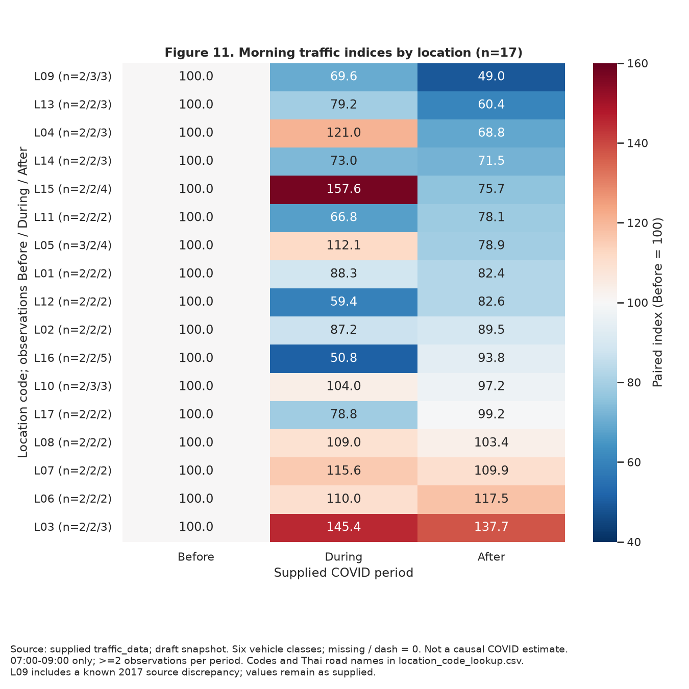

**คำถาม:** แต่ละสถานที่มีรูปแบบการเปลี่ยนแปลงเหมือนกันหรือไม่?

**วิธีอ่าน:** แต่ละแถวคือคู่ทางแยก–ถนนช่วง 07:00–09:00 ที่มีอย่างน้อย 2 รายการในแต่ละช่วงโควิด รวม 17 คู่ คอลัมน์คือ Before/During/After ตัวเลขคือดัชนีที่ Before=100 สีน้ำเงินต่ำกว่าฐาน สีแดงสูงกว่าฐาน จำนวนข้างรหัสเป็น n ของแต่ละช่วง ไม่ใช่จำนวนรถ

**ผลและความหมาย:** บางขุนนนท์–จรัญสนิทวงศ์ (L03) สูงกว่าฐานทั้ง During และ After ส่วนมิตรไมตรี (L09) ต่ำกว่าฐานทั้งสองช่วง ขณะที่ห้วยขวาง–ประชาสงเคราะห์ (L15) สูงใน During แต่ต่ำใน After จึงไม่ควรเล่าทุกสถานที่เป็นรูปแบบเดียวกัน

**ข้อจำกัด:** แต่ละสถานที่เก็บคนละเดือนและมีวันสำรวจน้อย รหัส L09 มีรายการที่ต้องทวนต้นทาง Heatmap นี้เป็นตาราง ไม่ใช่แผนที่ภูมิศาสตร์

**ตารางประกอบ:** [ค่ากราฟ](outputs/additional_visuals/location_period_heatmap.csv), [รหัสและชื่อสถานที่](outputs/additional_visuals/location_code_lookup.csv)

## กราฟ 12 — วันสำรวจจริงรายสถานที่

**คำถาม:** ผลที่เห็นเกิดจากหลายวันสอดคล้องกัน หรือไวต่อวันสำรวจบางวัน?

**วิธีอ่าน:** 10 ช่องแทนสิบคู่ที่แสดงในกราฟ 8 รวม 68 รายการ แกนนอนเป็นวันสำรวจจริง แกนตั้งเป็นคันต่อชั่วโมง สีแสดง covid_period จุดไม่ได้เชื่อมเป็นเส้น เพราะไม่มีข้อมูลระหว่างวันสำรวจ แต่ละช่องใช้ช่วงแกนตั้งต่างกันเพื่อดูความแปรปรวนภายในสถานที่

**ผลและความหมาย:** เห็นฐาน Before ของห้วยขวางที่มีเพียงสองวันและค่าห่างกันมาก รวมถึง After ของเตาปูนที่มีเพียงสองวัน จึงอธิบายได้ว่าทำไมข้อสรุปของบางแห่งจึงไวต่อการตัดวันออกหนึ่งรายการ

**วงสีทอง:** เป็นการทำเครื่องหมายใกล้ปฏิทินบางช่วง เช่น ใกล้ปีใหม่หรือวันถัดจากวันแรงงาน ไม่ใช่การยืนยันว่ามีเทศกาลในพื้นที่หรือเทศกาลทำให้ปริมาณรถเปลี่ยน

**ข้อจำกัด:** ไม่ใช้เปรียบเทียบความสูงของจุดข้ามช่องโดยไม่อ่านแกน ไม่ใช่ข้อมูลต่อเนื่องรายวัน และยังไม่มีข้อมูลฝน/ก่อสร้าง/OD มาอธิบายสาเหตุ

**ตารางประกอบ:** [วันที่ วันในสัปดาห์ คันต่อชั่วโมง และแถว Excel](outputs/additional_visuals/case_survey_dates.csv)

## กราฟ 13 — Bubble ปริมาณฐาน × การเปลี่ยนแปลง

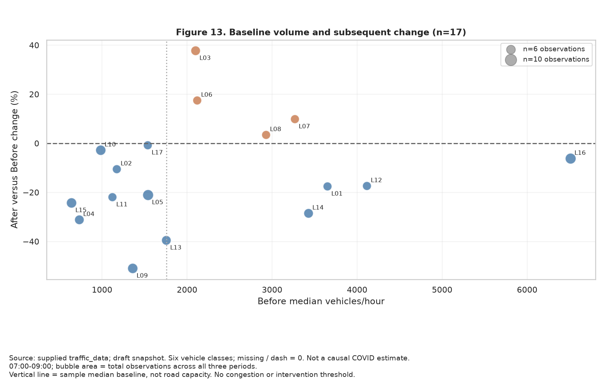

**คำถาม:** สถานที่ใดมีปริมาณฐานสูงและเปลี่ยนแปลงมาก เหมาะเลือกติดตามเพิ่มเติม?

**วิธีอ่าน:** แกนนอนเป็นมัธยฐานคันต่อชั่วโมงก่อนโควิด แกนตั้งเป็นเปอร์เซ็นต์ After เทียบ Before ขนาดพื้นที่จุดแสดงจำนวนรายการสำรวจรวมสามช่วง สีแยกเพิ่มกับลด เส้นตั้งเป็นมัธยฐานของปริมาณฐานในตัวอย่าง ไม่ใช่ความจุถนนหรือเกณฑ์ของหน่วยงาน

**ผลและความหมาย:** แยกสถานที่ที่เพิ่มมากเชิงเปอร์เซ็นต์ออกจากสถานที่ที่มีปริมาณรถเดิมสูงได้ บางขุนนนท์ (L03) เพิ่มชัด ขณะที่บางสถานที่มีฐานสูงแต่ดัชนียังต่ำกว่าฐาน การเลือกติดตามควรดูทั้งขนาดและการเปลี่ยนแปลง

**ข้อจำกัด:** ใช้เพียง 17 คู่ที่ผ่านเกณฑ์เวลาเช้า ขนาดจุดมากไม่ได้แปลว่าตัวอย่างสุ่มหรือมีคุณภาพสูงกว่าเสมอ ผลไม่ได้บอกความติดขัดหรือความจำเป็นต้องปรับสัญญาณไฟ

**ตารางประกอบ:** [ข้อมูล Bubble และจำนวนตัวอย่าง](outputs/additional_visuals/location_bubble_data.csv)

## กราฟ 14 — ผลต่างค่าเฉลี่ยแยกประเภทรถ

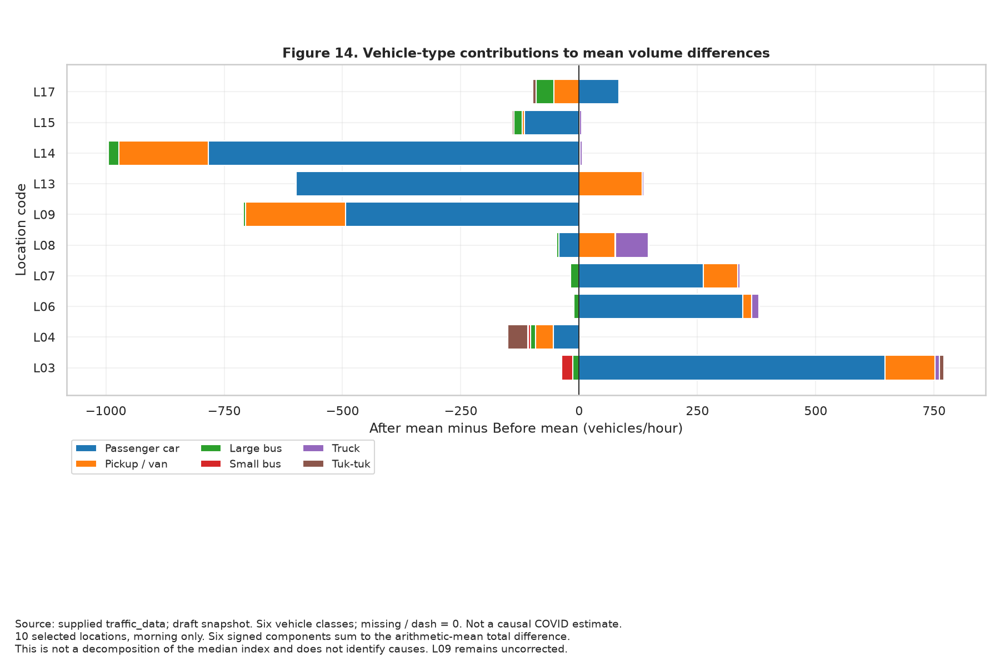

**คำถาม:** รถประเภทใดเป็นส่วนประกอบหลักของผลต่างเชิงตัวเลข?

**วิธีอ่าน:** แท่งสีแต่ละประเภทคือค่าเฉลี่ยคันต่อชั่วโมง After ลบ Before ค่าบวกไปขวา ค่าลบไปซ้าย ผลบวกแบบมีเครื่องหมายของทั้งหกประเภทรวมเท่ากับผลต่างค่าเฉลี่ยจำนวนรถรวมของสถานที่นั้น

**ผลและความหมาย:** บางขุนนนท์ (L03) มีส่วนเพิ่มจากรถยนต์นั่งเด่น ส่วนมิตรไมตรี (L09) และหลักสี่–แจ้งวัฒนะ (L14) มีส่วนลดจากรถยนต์นั่งมาก หลักสี่–กำแพงเพชร 6 (L13) มีตู้/ปิกอัพเพิ่มสวนกับรถยนต์นั่งที่ลด

**ข้อจำกัด:** ใช้ค่าเฉลี่ยเพื่อให้ส่วนประกอบรวมกันได้ จึงไม่ใช่การแยกดัชนีมัธยฐานของกราฟ 8 และไม่ใช่การแยกสาเหตุของการเปลี่ยนแปลง ค่ารถบางประเภทอาจได้รับผลจากการรวบรวมข้อมูลและสมมติฐานศูนย์

**ตารางประกอบ:** [ผลต่างค่าเฉลี่ยรถทั้งหกประเภท](outputs/additional_visuals/vehicle_mean_contributions.csv)

## กราฟ 15 — ดัชนีพร้อมช่วงความไม่แน่นอน

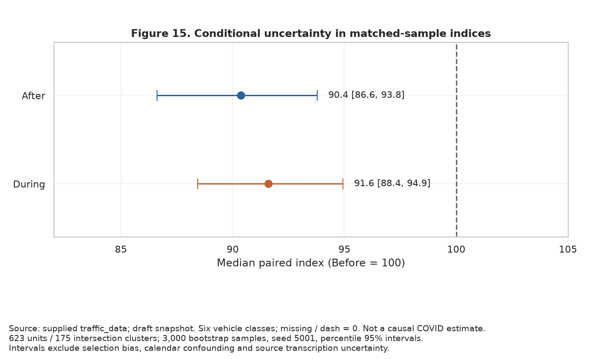

**คำถาม:** ค่ากลางในตัวอย่างมีความไม่แน่นอนเพียงใด?

**วิธีอ่าน:** จุดคือมัธยฐานดัชนี เส้นแนวนอนคือช่วง percentile 95% จาก bootstrap 3,000 รอบ โดยสุ่มเป็นกลุ่มทางแยก 175 แห่งและเก็บหน่วยถนน/เวลาในแยกนั้นไปด้วย รวมชุดหลัก 623 หน่วย เส้นตั้ง 100 คือฐาน Before

**ผลและความหมาย:** During 91.6 มีช่วง 88.4–94.9 และ After 90.4 มีช่วง 86.6–93.8 ภายในแบบจำลองการสุ่มซ้ำนี้ค่ากลางยังต่ำกว่าฐาน

**ข้อจำกัด:** ช่วงนี้ไม่รวมความคลาดเคลื่อนต้นทาง การเลือกสถานที่ที่ไม่สุ่ม ความต่างปฏิทิน หรือผลโครงข่าย จึงไม่ใช่ช่วงความเชื่อมั่นของผลเชิงสาเหตุจากโควิด และไม่ได้พิสูจน์ว่า After ต่างจาก During

**ตารางประกอบ:** [Bootstrap พร้อม seed และจำนวนรอบ](outputs/additional_visuals/cluster_bootstrap.csv)

## กราฟ 16 — แผนที่การเปลี่ยนแปลงในกรุงเทพฯ

**คำถาม:** จุดที่ตรวจพิกัดได้กระจายอยู่บริเวณไหน และแสดงรูปแบบเพิ่ม–ลดอย่างไร?

**วิธีอ่าน:** ช่องซ้ายแสดงขอบเขตกรุงเทพฯ และตำแหน่งจุดที่มีข้อมูล ช่องกลางและขวาขยายบริเวณจุดที่จับคู่ได้ แสดง During และ After เทียบ Before สีเดียวกันใช้สเกลเดียวกัน สีน้ำเงินต่ำกว่าฐาน สีแดงสูงกว่าฐาน หนึ่งจุดแสดงมัธยฐานดัชนีของคู่ถนนที่ผ่านการตรวจในแยกนั้น เฉพาะช่วง 07:00–09:00

**ขอบเขต:** 21 ทางแยก รวม 42 คู่ทางแยก–ถนน จากชุดหลัก 175 ทางแยก อีก 154 ทางแยกยังไม่อยู่ในแผนที่นี้ พื้นที่ไม่มีจุดไม่ใช่ปริมาณรถศูนย์ จึงไม่ระบายค่าต่อเนื่องทั่วเมืองและไม่ตีความเป็น hotspot ทั้งกรุงเทพฯ

**วิธีตรวจพิกัด:** ใช้จุด OpenStreetMap ที่ระบุเป็น junction และจับคู่ชื่อทางแยกหลังตัดคำขึ้นต้นแยก จากนั้นตรวจชื่อถนนที่เชื่อมกับ node โดยตรง เลือกเฉพาะคู่ถนนที่ตรงกันและอยู่ในขอบเขตกรุงเทพฯ ตัวอย่างชื่อที่ไม่ผ่านคือ “พัฒนาการ” เพราะถนนที่เชื่อมพิกัดไม่ใช่ถนนคู่เดียวกับข้อมูลเรา

**แหล่งภูมิศาสตร์:** [OpenStreetMap contributors](https://www.openstreetmap.org/copyright) และ [geoBoundaries — THA ADM1](https://www.geoboundaries.org/api/current/gbOpen/THA/ADM1/) บันทึก metadata และใบอนุญาตใน data/reference/map_sources.json ใช้ขอบเขตและพิกัดอ้างอิงปัจจุบัน ไม่ใช่ GPS ที่หน่วยงานบันทึกในวันสำรวจ

**ข้อจำกัด:** ตรวจได้จากชื่อและโครงข่ายในแผนที่ ไม่ได้ยืนยันตำแหน่งจุดยืนตรวจนับในอดีต จุดเดียวอาจมีถนนที่เปลี่ยนต่างทิศกัน ต้องอ่านตารางรายถนนประกอบ ไม่มีแผนที่จำนวนรถติดหรือแผนที่ผลเชิงสาเหตุของโควิด

**ตารางประกอบ:** [ค่ารายถนนพร้อมพิกัดและลิงก์ OSM](outputs/additional_visuals/map_road_period_indices.csv), [ค่าที่ใช้แสดงรายจุด](outputs/additional_visuals/map_intersection_summary.csv)

## แนวทางจากงานรุ่นพี่

ศึกษาแนวการใช้แผนที่จาก [Earthquake](https://github.com/tontantip/DADS5001-Project-Earthquake/), การวางขนาดกับการเปลี่ยนแปลงจาก [IPUC](https://github.com/ChotepipatC/DADS5001), และการดูการกระจาย/ความถี่ประกอบค่ากลางจาก [PM2.5](https://github.com/Porrakij/PM2.5-Data-Analysis) ไม่ได้นำข้อมูลหรือโค้ดของงานเหล่านั้นมาคำนวณผลจราจร

สำหรับ Pitch เลือกกราฟที่ตอบคนละคำถาม เช่น coverage → ภาพรวม → heatmap สถานที่ → วันสำรวจ → แผนที่ → กรณีศึกษา พร้อมข้อจำกัด ไม่จำเป็นต้องแสดงครบ 16 รูปในเวลาจำกัด

แผนที่เพิ่มเติม: [แผนที่ออฟไลน์ เลือกช่วงโควิดและดูถนนรายจุด](outputs/additional_visuals/bangkok_map_interactive.html)
